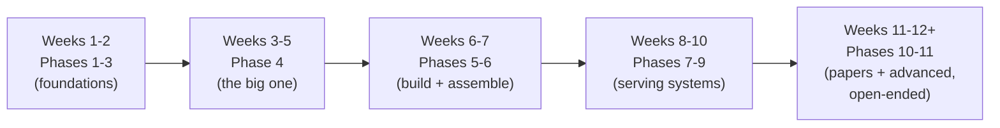

# Start Here

*This page exists for one reason: to make sure you don't get stuck before you even begin. Read this first, then go to [README.md](README.md) for the actual roadmap.*

---

## Do you need any setup?

**No installation required to start.** Every code example in this repo runs in a free tool called **Google Colab** — a notebook that runs Python in your browser, with nothing to install.

1. Go to [colab.research.google.com](https://colab.research.google.com)
2. Sign in with any Google account
3. Click "New Notebook"
4. In the first cell, type `!pip install torch` and press Shift+Enter to run it
5. You're ready — every code snippet in Phases 1-9 can be pasted directly into cells like this

If you'd rather run things on your own computer instead, you'll need Python 3.9+ and can install everything with:
```bash
pip install torch
```

---

## What background do you need?

- **Python:** basic level — if you can write a `for` loop and call a function, you have enough. Phase 2 teaches everything else you need.
- **Math:** high-school algebra. No calculus or linear algebra required upfront — both get built up gradually, with intuition first, starting in Phase 2.
- **Machine learning:** none. Phase 1 assumes zero prior exposure to AI/ML concepts.

If you've never written any code at all, that's the one real prerequisite — pause here and spend a day or two on a beginner Python tutorial first (freeCodeCamp's Python course is a solid free option), then come back.

---

## How long will this take?

Realistically, **8-12 weeks at 1-2 hours a day**, going in order. Some phases are a couple of days, some (Phase 4, Phase 7) are 1-2 weeks. This is not a race — the checkpoint questions at the end of each phase exist specifically so you know when you're actually ready to move on, rather than just having scrolled past the content.



---

## How to actually use each phase

Every phase folder follows the same pattern:

1. **Read the intuition first** — the plain-English explanation before any formula.
2. **Read the math** — don't skip it once you have the intuition; the formula is what lets you actually predict what code will do.
3. **Look at the diagram** — it's there to make the data flow visual, not just decorative.
4. **Run the code yourself** — don't just read it. Paste it into Colab, change a number, see what happens.
5. **Answer the checkpoint questions on paper, without looking back at the text.** This is the real test of whether it stuck. If you can't answer one, that's not a failure — it's useful information telling you exactly what to re-read.
6. **Phases 2 and 5 have exercises with full [solutions](phases/02-math-tensor-foundations/exercise-solutions.md) — try them yourself before checking.**

---

## What if I get stuck?

- **A code error:** read the actual error message slowly — PyTorch's shape-mismatch errors are usually very literal about what went wrong. Nine times out of ten, the fix is in the error text itself.
- **A concept that isn't clicking:** every phase links out to videos and articles at the bottom under "Resources" — often a different explanation style is all it takes.
- **Genuinely stuck:** open an issue on this repo describing exactly where you got lost. That also helps make this resource better for the next person.

---

Ready? Go to **[README.md](README.md)** and start with Phase 1.
