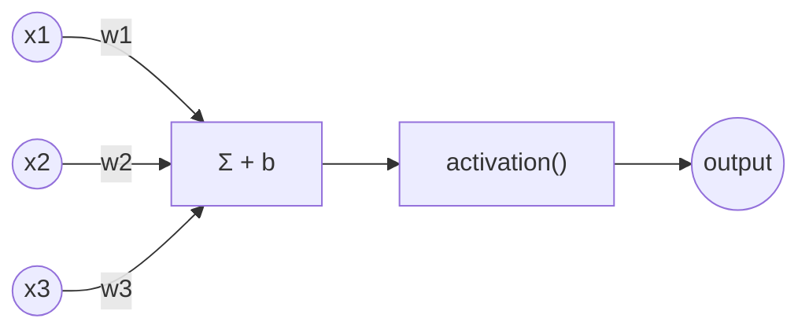
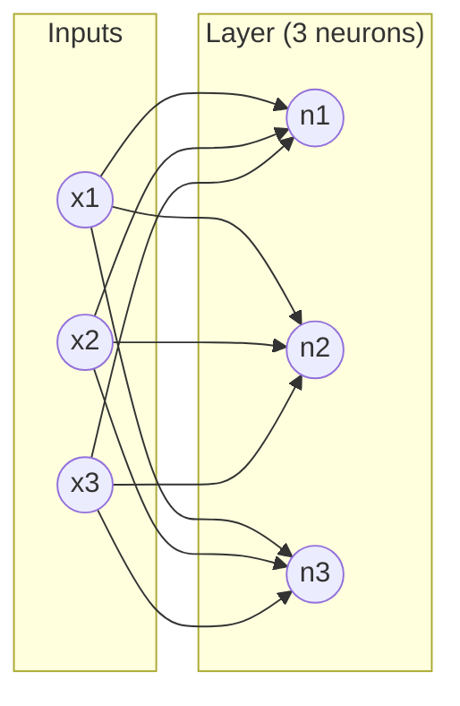
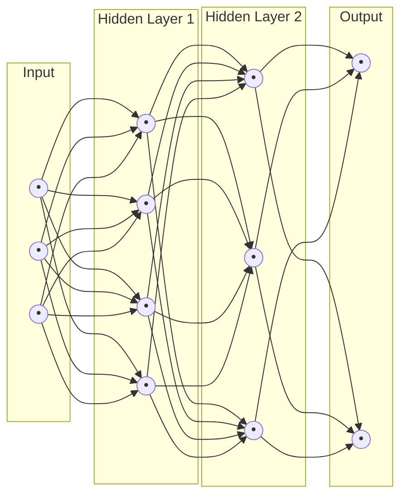
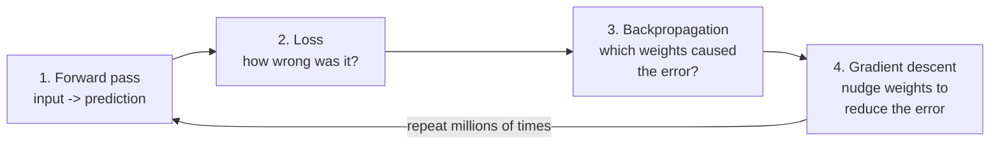
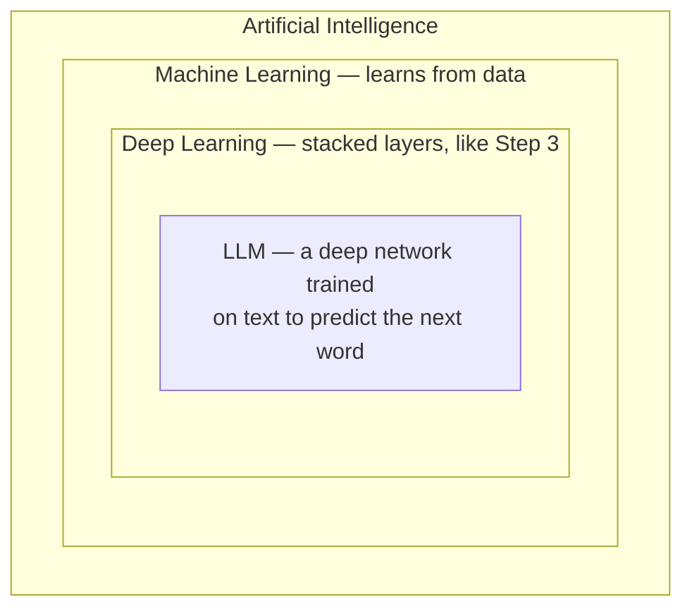

# Phase 1 — How Neural Networks Are Built (From One Neuron to a Network)

*No LLM makes sense until this clicks. We build it up piece by piece: one neuron → a layer → a network → training it → using it.*

---

## Step 1: A Single Neuron

A neuron takes some numbers in, multiplies each by a "weight," adds them up, adds a bias, then squashes the result through a non-linear function.

**In plain words:** each input `x` gets scaled by how important it is (`w`), all the scaled inputs are added together with an offset (`b`), and the total is passed through a function that decides how "activated" this neuron is.

$$\text{output} = \text{activation}(w_1 x_1 + w_2 x_2 + w_3 x_3 + b)$$

That's the entire building block. Everything else is just many of these, arranged cleverly.

---

## Step 2: A Layer (Many Neurons Side by Side)

A layer is several neurons, each looking at the *same* inputs, each with its *own* weights — computed in parallel.

Every line in that picture is a separate weight. 3 inputs × 3 neurons = 9 weights just for this one layer.

---

## Step 3: A Network (Layers Stacked)

Stack layers so one layer's output becomes the next layer's input. This is what "deep" in "deep learning" refers to — depth, i.e. number of stacked layers.

**Why the non-linear activation matters:** if you removed it, stacking layers would be pointless — a stack of purely linear operations collapses into one single linear operation. The non-linearity is what lets the network bend and curve instead of only drawing straight lines.

---

## Step 4: How the Network Gets Built — Training

The network above starts with *random* weights. Training is the process that turns random weights into useful ones.

1. **Forward pass** — push an input through the network exactly like Step 3's diagram, get a prediction.
2. **Loss** — compare the prediction to the correct answer with one number: "how wrong."
3. **Backpropagation** — use calculus to work out how much *each individual weight* contributed to that wrongness.
4. **Gradient descent** — nudge every weight slightly in the direction that reduces the wrongness.

Repeat this loop millions or billions of times, on millions of examples, and the random weights slowly turn into weights that actually solve the problem.

---

## Step 5: Using the Trained Network — Inference

Once training is done, the weights are **frozen**. Using the network is just Step 3's forward pass again — input in, prediction out. No more loss, no more backprop.

> This distinction matters a lot later: **vLLM (which you'll meet in Phase 8-9) is built only for this frozen, inference step** — it never trains anything. It's an engine for running the forward pass fast, at scale, for millions of users.

---

## Step 6: Where AI, ML, Deep Learning, and LLMs Fit

| Layer | What makes it that layer |
|---|---|
| **AI** | Any system doing a task that normally needs human thinking |
| **ML** | Learns its behavior from data instead of hand-written rules |
| **DL** | ML using the stacked-layer networks from Step 3 |
| **LLM** | A deep network specifically trained on text to predict the next token |

---

## ✅ Checkpoint — can you explain these out loud?

1. Draw a single neuron and label every part (`w`, `x`, `b`, `activation`).
2. Explain why stacking layers without an activation function would be pointless.
3. Walk through the training loop: forward pass → loss → backprop → gradient descent.
4. Explain the difference between training and inference in one sentence each.

If any of these feel shaky, re-read this file before moving on — Phase 2 builds directly on top of it.

## Resources

- 🎥 [3Blue1Brown — But what is a Neural Network?](https://www.youtube.com/watch?v=aircAruvnKk) — watch the full 4-video series.
- 🎥 [Andrej Karpathy — Intro to Large Language Models](https://www.youtube.com/watch?v=zjkBMFhNj_g)
- 📘 [Michael Nielsen — Neural Networks and Deep Learning](http://neuralnetworksanddeeplearning.com/) (Ch. 1-2)
