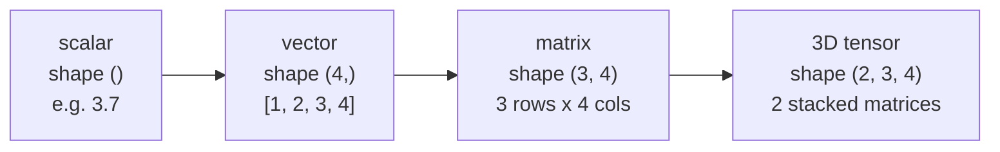
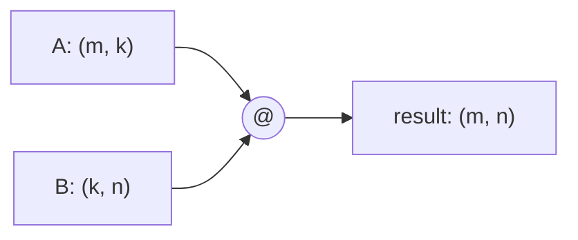
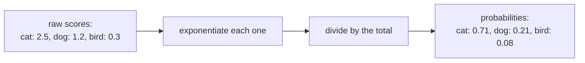
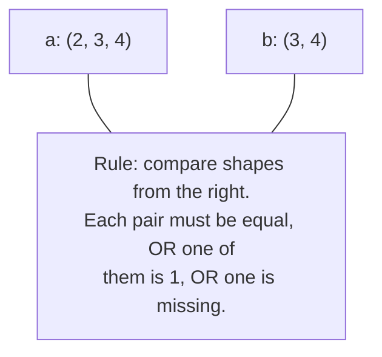

# Phase 2 — Math & Tensor Foundations

*Every operation inside a transformer is a tensor operation. If shapes don't click here, nothing later will make sense — so we go slow.*

---

## Step 1: What's a Tensor?

A tensor is just "a grid of numbers with some number of dimensions." The word changes only based on how many dimensions it has:



| Name | Dimensions | Example shape |
|---|---|---|
| Scalar | 0 | `()` — just one number, e.g. `3.7` |
| Vector | 1 | `(4,)` — e.g. `[1, 2, 3, 4]` |
| Matrix | 2 | `(3, 4)` — 3 rows, 4 columns |
| Tensor | 3+ | `(2, 3, 4)` — 2 matrices of 3×4 |

**Why this matters:** when you read transformer code later, you'll spend most of your time tracking *shapes*, not values. Build the habit now — for every line of code, ask "what shape does this produce?"

---

## Step 2: Matrix Multiplication

If `A` has shape `(m, k)` and `B` has shape `(k, n)`, then `A @ B` has shape `(m, n)`. The middle numbers (`k`) must match — they "cancel out."



**Geometric intuition:** a matrix is a machine that takes a vector in and gives you a rotated/stretched vector out. Multiplying is applying that transformation.

**In code:**
```python
import torch

A = torch.randn(2, 3)   # shape (2, 3)
B = torch.randn(3, 4)   # shape (3, 4)
C = A @ B                # shape (2, 4) -- the 3's cancelled
print(C.shape)           # torch.Size([2, 4])
```

---

## Step 3: Softmax — Turning Numbers Into Probabilities

Softmax takes any list of numbers and turns it into a probability distribution — all positive, all summing to 1. This is how a model turns raw scores into "how likely is each next word."



**In code:**
```python
import torch

scores = torch.tensor([2.5, 1.2, 0.3])
probs = torch.softmax(scores, dim=0)
print(probs)   # tensor([0.71, 0.21, 0.08])  -- adds up to 1.0
```

**Temperature** controls how "sharp" this distribution is. Dividing scores by a small number before softmax makes the top choice much more dominant; dividing by a large number flattens it out. You'll see this again when models generate text.

---

## Step 4: Reshaping — Same Numbers, Different Shape

You'll constantly need to reorganize a tensor's shape without changing its actual values.

```python
x = torch.randn(2, 3, 4)   # 24 numbers total

x.view(6, 4)     # same 24 numbers, reshaped to (6, 4)
x.view(2, -1)    # -1 means "figure this dimension out" -> (2, 12)
```

**The rule that never breaks:** the total count of numbers must stay the same before and after. `2*3*4 = 24`, and `6*4 = 24`, and `2*12 = 24`. If the counts don't match, PyTorch will error.

---

## Step 5: Broadcasting — Combining Different Shapes

Broadcasting lets you add/multiply tensors of *different* shapes, as long as they're "compatible."



```python
a = torch.randn(2, 3, 4)
b = torch.randn(3, 4)     # smaller, but broadcasts fine
a + b                      # works -- result shape (2, 3, 4)
```

This shows up constantly in attention, where you combine tensors of shape `(batch, heads, seq, dim)` with smaller mask tensors.

---

## ✅ Checkpoint

1. What's the difference between a vector, a matrix, and a tensor? Give an example shape for each.
2. If `A` is `(4, 8)` and `B` is `(8, 2)`, what shape is `A @ B`?
3. Explain in your own words why softmax outputs always sum to 1.
4. What's the one rule that must hold true when you `.view()` or `.reshape()` a tensor?

If any of these are shaky, re-run the code snippets above yourself in a Python shell or Colab notebook before moving to Phase 3.

## Resources

- 🎥 [3Blue1Brown — Essence of Linear Algebra (playlist)](https://www.youtube.com/playlist?list=PLZHQObOWTQDPD3MizzM2xVFitgF8hE_ab)
- 📄 [PyTorch — Learn the Basics](https://pytorch.org/tutorials/beginner/basics/intro.html)
- 📄 [PyTorch — Broadcasting Semantics](https://pytorch.org/docs/stable/notes/broadcasting.html)

---

📝 **[Exercise Solutions](exercise-solutions.md)** — check your work on the Step 5 exercises here.
