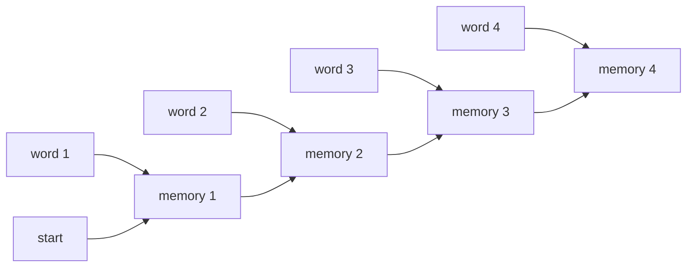
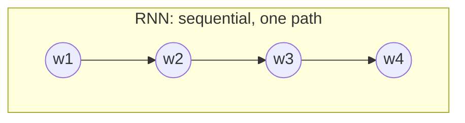
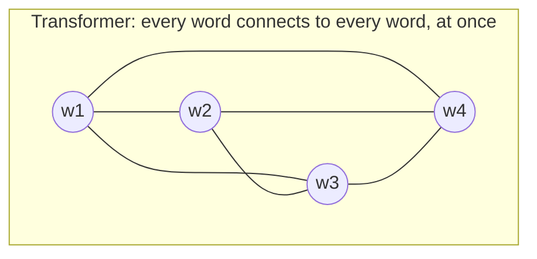

# Phase 3 — Why Transformers Were Invented

*Before transformers, sequence models were RNNs. To appreciate why the transformer was such a big deal in 2017, you need to feel the pain RNNs caused first.*

---

## Step 1: The RNN — One Word at a Time

An RNN reads a sequence one piece at a time, carrying a "memory" (hidden state) forward from each step to the next.

To compute "memory 4," the RNN first needs "memory 3," which needs "memory 2," which needs "memory 1." **Everything happens in strict order — one step cannot start before the previous one finishes.**

---

## Step 2: Three Problems This Causes

**1. It can't use modern hardware well.** GPUs are built to do thousands of things at once (in parallel). An RNN forces everything into a single-file line — you're paying for a thousand-lane highway and using one lane.

**2. Long sentences lose information.** Imagine reading: *"The cat, which had been sitting on the mat for hours despite the rain falling all morning, was hungry."* By the time an RNN reaches "was," the memory of "cat" from the start has been overwritten many times over. This is called **long-context decay**.

**3. Training breaks down over long sequences.** The math used to train RNNs (backpropagation) multiplies a number through every single time step. Multiply a number slightly less than 1 a hundred times, and it shrinks to nearly zero — the network stops learning from anything far in the past. This is called the **vanishing gradient problem**.

---

## Step 3: The Fix — Attention

In 2017, researchers asked: what if, instead of forcing information through one narrow memory channel step by step, every word could look directly at every other word, all at once?

No more waiting in line. Every word gets a direct line to every other word, computed simultaneously. This is what "attention" means: each word decides how much to "pay attention to" every other word, directly, without relaying information through a chain.

---

## Step 4: The Trade-Off

Nothing is free. Connecting every word to every other word means the amount of computation grows with the **square** of the sentence length — twice as many words means four times the computation (this is written as **O(n²)**).

| RNN downsides | What the transformer gains |
|---|---|
| Sequential — can't parallelize | Fully parallel — huge GPU speedup |
| Old information decays | Direct connection to every word, no decay |
| Struggles with long sentences | Handles long-range relationships natively |

**Trade-off:** cheap-per-step-but-slow-overall (RNN) vs. more-compute-per-step-but-massively-faster-overall (transformer, O(n²)).

That O(n²) cost is *exactly* the reason systems like vLLM exist later in this roadmap — a huge amount of engineering exists purely to make that cost manageable at scale.

---

## ✅ Checkpoint

1. Why can't an RNN take advantage of a GPU's parallel processing power?
2. What is "long-context decay," in your own words, with your own example sentence?
3. What does the transformer trade away in exchange for parallelism?
4. Why would doubling the sentence length roughly quadruple a transformer's compute cost?

## Resources

- 🎥 [StatQuest — RNNs Clearly Explained](https://www.youtube.com/watch?v=AsNTP8Kwu80)
- ✍️ [Christopher Olah — Understanding LSTM Networks](https://colah.github.io/posts/2015-08-Understanding-LSTMs/)
- 🎥 [3Blue1Brown — Attention in transformers, visually explained](https://www.youtube.com/watch?v=eMlx5fFNoYc)
