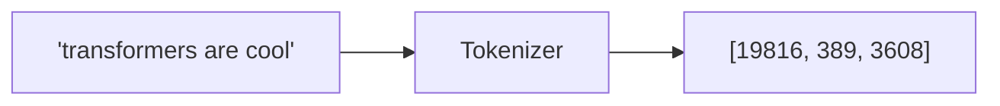
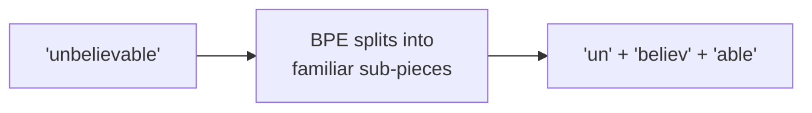
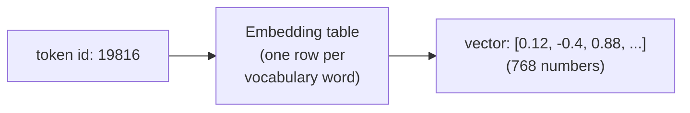
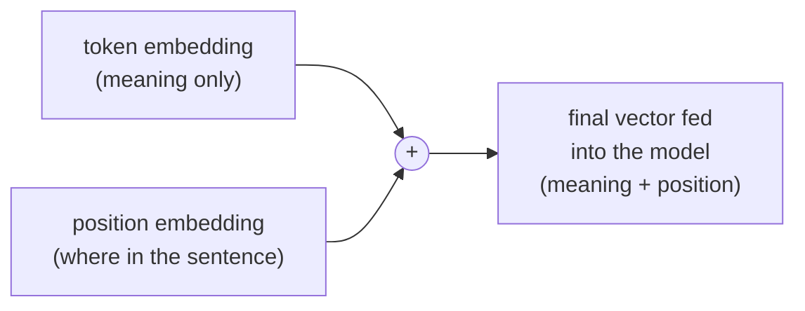

# Phase 4 — Transformers Deep Dive (Part 1: Getting Text Into the Model)

*This is the most important phase in the whole roadmap. Everything in later phases traces back to the mechanics here. We go slow and build it piece by piece: text → tokens → vectors → position-aware vectors. Part 2 (in the next section) covers attention itself.*

---

## Step 1: Tokenization — Turning Text Into Numbers

Neural networks only understand numbers, never raw text. A **tokenizer** is the translator: text in, a sequence of integer IDs out (and back again).



**Why not just split by character or by word?**

- **By character:** tiny vocabulary (~128 symbols), but sequences get very long. "transformer" becomes 11 separate tokens instead of 1 — and since attention cost grows with the *square* of sequence length (Phase 3), this is expensive.
- **By word:** short sequences, but a huge vocabulary (millions of English words), and any word not seen during training becomes an unrecognized "unknown" token.

**The real answer — sub-words (BPE):** Most LLMs split text into pieces bigger than a character but smaller than a full word — common words stay whole ("the", "cat"), rare or unusual words get broken into familiar chunks ("transform" + "er"). This keeps the vocabulary manageable (tens of thousands of entries) while keeping sequences reasonably short.



---

## Step 2: Embeddings — Turning IDs Into Meaning

A token ID like `19816` is just an arbitrary number — it carries no meaning on its own. An **embedding** is a lookup table that converts each ID into a vector of numbers (say, 768 numbers) that *does* carry meaning, learned during training.



**The key property:** after training, tokens with similar meaning end up with similar vectors. The vector for "king" sits close to the vector for "queen" in this high-dimensional space, and far away from the vector for "banana."

**In code:**
```python
import torch
import torch.nn as nn

vocab_size = 50000   # how many unique tokens the model knows
embed_dim = 768       # size of each token's vector

embedding_table = nn.Embedding(vocab_size, embed_dim)

token_ids = torch.tensor([[19816, 389, 3608]])   # shape (batch=1, seq_len=3)
vectors = embedding_table(token_ids)              # shape (1, 3, 768)
print(vectors.shape)   # torch.Size([1, 3, 768])
```

Notice the shape change: `(batch, seq_len)` integers in, `(batch, seq_len, embed_dim)` vectors out. One 768-number vector per token.

---

## Step 3: Positional Encoding — Telling the Model Word Order

Here's a subtlety that trips people up: the attention mechanism (Phase 4 Part 2) looks at all tokens **at once**, with no built-in sense of order. Left completely alone, "the cat chased the dog" and "the dog chased the cat" would look identical to it — same set of tokens, no notion of sequence.

**The fix:** add a unique "position" vector to each token's embedding, so token 1's vector is nudged differently than token 2's vector, and so on.



**Why not just add the plain numbers 1, 2, 3...?** Because those numbers get arbitrarily large for long sequences, throwing off the scale of everything else in the network. Instead, the original transformer paper used **sinusoidal** positional encodings — smooth wave patterns (sine and cosine) at different frequencies, layered together, that give every position a unique, bounded "fingerprint."

Think of it like a clock: a fast-moving second hand and a slow-moving hour hand together tell you exactly what time it is, even though each hand alone is ambiguous (the second hand alone repeats every 60 seconds). Combining several sine/cosine waves of different frequencies works the same way — together they uniquely identify a position, even though any single wave alone would repeat.

Some models (GPT-2, BERT) instead just *learn* a position embedding table, the same way they learn token embeddings — simpler, but limited to whatever maximum length was seen during training.

---

## Checkpoint

1. Why do LLMs use sub-word tokenization instead of splitting by character or by whole word?
2. What shape transformation happens when you pass token IDs through an embedding table?
3. Why does the model need positional encoding at all, what would break without it?
4. In your own words, explain the "clock hands" analogy for sinusoidal positional encoding.

## Resources

- Andrej Karpathy - Let's build the GPT Tokenizer: https://www.youtube.com/watch?v=zduSFxRajkE
- Jay Alammar - The Illustrated Transformer: https://jalammar.github.io/illustrated-transformer/
- Vaswani et al. (2017) - Attention Is All You Need: https://arxiv.org/abs/1706.03762
