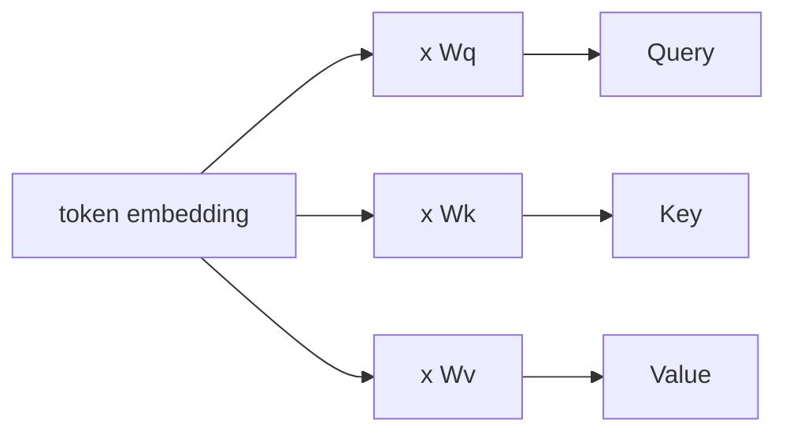
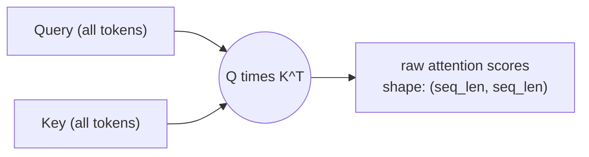
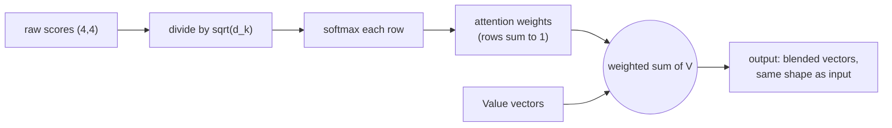
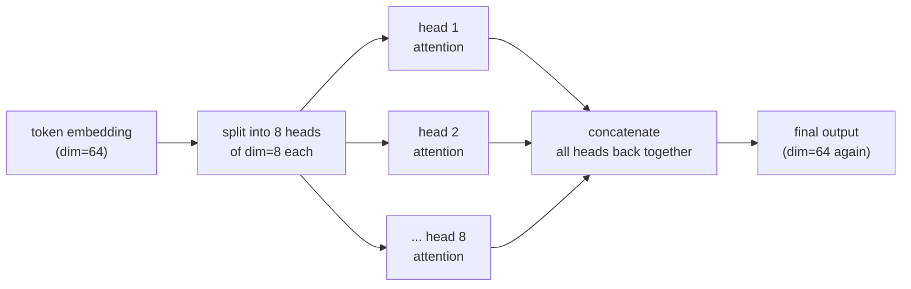
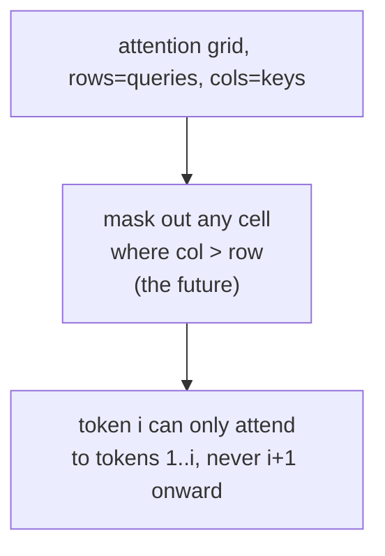

# Phase 4 — Transformers Deep Dive (Part 2: Self-Attention)

*Part 1 got text into position-aware vectors. Now we cover the mechanism that made transformers famous: how each token decides what to "pay attention to."*

---

## Step 1: The Core Idea — Query, Key, Value

For every token, the model creates three different vectors from its embedding, by multiplying it with three learned weight matrices:

- **Query (Q)** — "what am I looking for?"
- **Key (K)** — "what do I contain, that others might look for?"
- **Value (V)** — "what information do I actually give out, if someone attends to me?"



**An analogy:** imagine a library search. Your **Query** is your search phrase. Every book's **Key** is like its index card, describing what it's about. You compare your Query against every Key to find the best matches. The **Value** is the actual content of the book you end up reading, once you've found a match.

---

## Step 2: Scoring — How Much Should Each Token Attend to Each Other Token?

To find out how relevant token A is to token B, take the dot product of A's Query with B's Key. Do this for every pair of tokens, and you get a full grid of "relevance scores."



**In code, with shapes:**
```python
import torch

seq_len, dim = 4, 8
Q = torch.randn(seq_len, dim)   # shape (4, 8)
K = torch.randn(seq_len, dim)   # shape (4, 8)

scores = Q @ K.T                 # shape (4, 4) -- one score per (query, key) pair
print(scores.shape)              # torch.Size([4, 4])
```

Row `i`, column `j` of that `(4, 4)` grid answers: "how relevant is token `j` to token `i`?"

---

## Step 3: Scaling and Softmax — Turning Scores Into Weights

Raw scores can get large, which makes training unstable. Divide by the square root of the dimension size first, then run softmax (Phase 2, Step 3) across each row so the scores for each token turn into a clean probability distribution that sums to 1.

$$\text{Attention}(Q, K, V) = \text{softmax}\left(\frac{QK^T}{\sqrt{d_k}}\right) V$$

- `Q K^T` → raw relevance scores between every pair of tokens
- `sqrt(d_k)` → scaling factor that keeps numbers in a stable range
- `softmax(...)` → turns each row into a probability distribution ("how much attention to pay to each other token")
- multiplying by `V` → blend the Value vectors according to those attention weights



**Full code:**
```python
import torch
import torch.nn.functional as F

seq_len, dim = 4, 8
Q = torch.randn(seq_len, dim)
K = torch.randn(seq_len, dim)
V = torch.randn(seq_len, dim)

scores = Q @ K.T / (dim ** 0.5)       # shape (4, 4)
weights = F.softmax(scores, dim=-1)  # shape (4, 4), each row sums to 1
output = weights @ V                  # shape (4, 8) -- same shape as V

print(output.shape)   # torch.Size([4, 8])
```

---

## Step 4: Multi-Head Attention — Many Perspectives at Once

Instead of computing attention once, split the embedding dimension into several smaller "heads," and run the whole Query-Key-Value process independently in each one, in parallel. One head might learn to track grammar, another might track meaning, another might track long-range references — the model discovers these specializations on its own during training.



**Shape walkthrough:** if a token's embedding has dimension 64, and you use 8 heads, each head works with dimension `64 / 8 = 8`. Every head does its own full Query-Key-Value-softmax dance on its own small slice, then all 8 outputs get concatenated back into a 64-dimensional vector.

---

## Step 5: Causal Masking — No Peeking at the Future

For a model that generates text one token at a time, token 3 must never be allowed to attend to token 5 — that would mean cheating by looking at a word that hasn't been generated yet. **Causal masking** enforces this: before the softmax step, every "future" position is set to negative infinity, so after softmax it becomes exactly zero attention weight.



This is why these models are called "autoregressive" (Phase 1, Step 3): generation is forced to only ever look backward, never forward.

---

## Checkpoint

1. In your own words, what do Query, Key, and Value each represent?
2. Why do we divide by sqrt(d_k) before the softmax step?
3. If a token embedding has dimension 512 and you use 8 heads, what's the dimension of each head?
4. Why is causal masking necessary for text generation specifically?

## Resources

- 3Blue1Brown - Attention in transformers, visually explained: https://www.youtube.com/watch?v=eMlx5fFNoYc
- Jay Alammar - The Illustrated Transformer: https://jalammar.github.io/illustrated-transformer/
- Andrej Karpathy - Let's build GPT from scratch: https://www.youtube.com/watch?v=kCc8FmEb1nY
