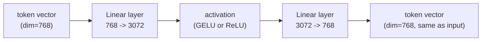
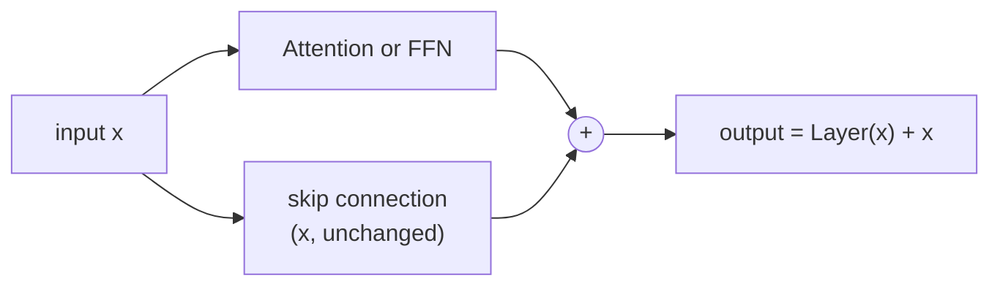
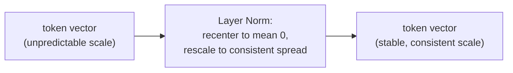
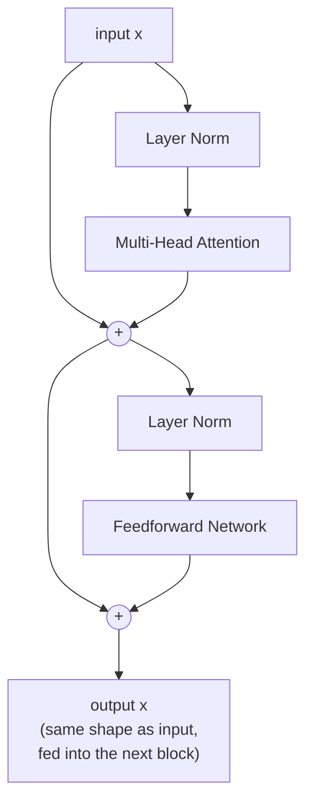
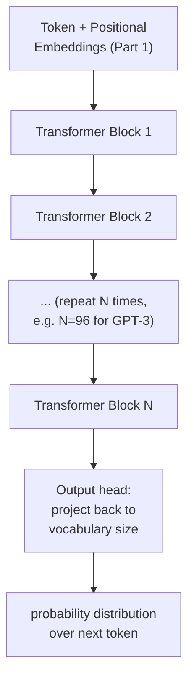

# Phase 4 — Transformers Deep Dive (Part 3: The Full Transformer Block)

*Part 2 covered attention in isolation. On its own, attention is not enough to build a working model — it needs a few more pieces around it. This part assembles the actual repeatable unit that gets stacked, over and over, to build a full transformer.*

---

## Step 1: The Problem Attention Alone Doesn't Solve

Attention lets tokens exchange information with each other. But it does two things that need fixing before this can be stacked into a deep network:

1. It's a purely linear blend of Value vectors (a weighted average) — no non-linearity, so it can't learn complex patterns on its own (recall Phase 1, Step 3: without non-linearity, stacking layers is pointless).
2. Stacking many attention layers back to back, with nothing else, tends to make training unstable — signals either shrink to nothing or blow up as they pass through many layers.

The transformer block fixes both with two additions: a **feedforward network** (adds non-linearity) and **residual connections + layer normalization** (keeps training stable).

---

## Step 2: The Feedforward Network (FFN)

After attention mixes information *between* tokens, the feedforward network processes *each token independently*, adding the non-linearity that attention itself lacks. It's a small 2-layer network applied identically to every token position.



**In code:**
```python
import torch
import torch.nn as nn

class FeedForward(nn.Module):
    def __init__(self, dim=768, hidden_dim=3072):
        super().__init__()
        self.net = nn.Sequential(
            nn.Linear(dim, hidden_dim),   # 768 -> 3072, expand
            nn.GELU(),                     # non-linearity
            nn.Linear(hidden_dim, dim),   # 3072 -> 768, project back
        )

    def forward(self, x):
        return self.net(x)   # shape in == shape out

ffn = FeedForward()
x = torch.randn(1, 4, 768)   # (batch=1, seq_len=4, dim=768)
out = ffn(x)
print(out.shape)   # torch.Size([1, 4, 768]) -- unchanged shape
```

Notice the "expand then shrink" pattern: 768 → 3072 → 768. The wider middle layer (usually 4x the input size) gives the network more room to represent complex functions, before compressing back to the original size so it can be added back into the residual stream (next step).

---

## Step 3: Residual Connections — Don't Force Every Layer to Learn Everything

A residual connection simply adds a layer's input back to its own output: `output = Layer(x) + x`. Instead of forcing each layer to produce the *entire* answer, it only has to learn what to *change* — the rest passes through untouched.



**Why this matters at scale:** modern LLMs stack dozens of these blocks (GPT-3 has 96). Without residual connections, gradients would have to flow backward through every single block during training, and (just like the RNN problem in Phase 3) they'd vanish or explode. The residual connection gives gradients a direct shortcut path straight back to earlier layers, keeping training stable even at huge depth.

---

## Step 4: Layer Normalization — Keeping Numbers in a Sane Range

As data flows through dozens of stacked blocks, the scale of the numbers can drift — some values growing huge, others shrinking to near zero. **Layer normalization** re-centers and re-scales each token's vector (independently, per token) to have a consistent mean and spread, right before it enters the next layer.



Think of it as a "reset to a comfortable range" step, applied per token, so every layer receives inputs in roughly the same numerical range regardless of how deep it is in the stack.

---

## Step 5: Putting It All Together — One Full Block

A modern transformer block (this ordering, "pre-norm," is what most current LLMs use) looks like this:



**In code:**
```python
import torch
import torch.nn as nn

class TransformerBlock(nn.Module):
    def __init__(self, dim=768, n_heads=8, hidden_dim=3072):
        super().__init__()
        self.norm1 = nn.LayerNorm(dim)
        self.attn = nn.MultiheadAttention(dim, n_heads, batch_first=True)
        self.norm2 = nn.LayerNorm(dim)
        self.ffn = FeedForward(dim, hidden_dim)

    def forward(self, x, mask=None):
        # attention sub-layer, with residual connection
        normed = self.norm1(x)
        attn_out, _ = self.attn(normed, normed, normed, attn_mask=mask)
        x = x + attn_out                 # residual connection

        # feedforward sub-layer, with residual connection
        normed = self.norm2(x)
        ffn_out = self.ffn(normed)
        x = x + ffn_out                  # residual connection

        return x   # same shape as input -- this is what makes stacking possible

block = TransformerBlock()
x = torch.randn(1, 4, 768)   # (batch=1, seq_len=4, dim=768)
out = block(x)
print(out.shape)   # torch.Size([1, 4, 768]) -- unchanged, ready for the next block
```

**The key insight that makes deep models possible:** the output shape of a block is identical to its input shape. That's what lets you stack dozens of these blocks back to back — block 2 doesn't care whether its input came from the embedding layer or from block 1, it looks the same either way.

---

## Step 6: Zooming Out — A Full Model Is Just This, Repeated



Everything from Phase 4 Part 1 through here is the entire architecture. Phase 6 covers this "zoomed out" view in more depth — how the output head works, how sampling picks the next token, and the full generation loop.

---

## Checkpoint

1. Why isn't attention alone enough to build a working transformer — what two problems does the block solve?
2. In your own words, what does a residual connection let a layer "skip" doing?
3. Why does layer normalization matter more as models get deeper?
4. Why must a transformer block's output shape exactly match its input shape?

## Resources

- Andrej Karpathy - Let's build GPT from scratch: https://www.youtube.com/watch?v=kCc8FmEb1nY
- Jay Alammar - The Illustrated Transformer: https://jalammar.github.io/illustrated-transformer/
- Vaswani et al. (2017) - Attention Is All You Need: https://arxiv.org/abs/1706.03762
