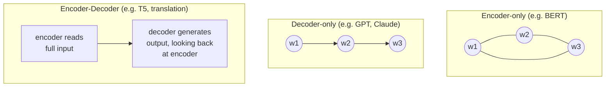
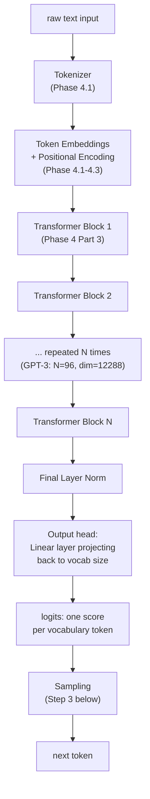
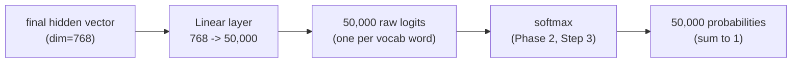
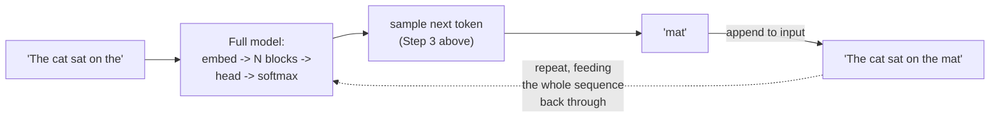

# Phase 6 — GPT & LLM Architecture

*Phase 4 built one transformer block. This phase zooms out: how blocks get arranged into a real, working model that turns text in and text out, and why that loop is the exact thing vLLM exists to optimize.*

---

## Step 1: Three Ways to Arrange Transformer Blocks

Not every transformer is built the same way. There are three architectural families, and the difference comes down to what each token is allowed to look at.



| Type | Each token sees | Good for | Example |
|---|---|---|---|
| **Encoder-only** | Every other token, both directions, no restriction | Understanding tasks: classification, search, embeddings | BERT |
| **Decoder-only** | Only previous tokens (causal masking, Phase 4 Part 2) | Generation: writing text one token at a time | GPT, Claude, Llama |
| **Encoder-Decoder** | Encoder sees everything; decoder is causal but also looks back at the encoder's output | Translation, summarization: transform one sequence into another | T5, original transformer paper |

**Every modern LLM you've used — GPT, Claude, Llama, Mistral — is decoder-only.** This roadmap has focused on decoder-only from the start, since that's the architecture behind the models this whole repo is building toward understanding.

---

## Step 2: The Full GPT Architecture, Top to Bottom

Zooming all the way out, here is everything from Phase 1 through Phase 4, assembled into one pipeline:



Everything you've built in Phases 1-5 is already in this diagram. Phase 6 is entirely about the pieces at the bottom: turning the last block's output into an actual chosen word, and the loop that repeats this to generate a whole response.

---

## Step 3: Logits, Probabilities, and Sampling

The output head is a single `Linear` layer that projects the final hidden vector (e.g. dimension 768) up to the vocabulary size (e.g. 50,000) — producing one raw score, called a **logit**, per possible next token.



Softmax (which you already know from Phase 2) turns these 50,000 raw scores into a proper probability distribution. From here, **how you pick the next token is a design choice**, not a fixed rule:

| Sampling strategy | How it works | Effect |
|---|---|---|
| **Greedy** | Always pick the single highest-probability token | Deterministic, but can be repetitive/boring |
| **Temperature sampling** | Divide logits by a temperature `T` before softmax (Phase 2, Step 3), then sample randomly according to the resulting probabilities | Higher `T` = more random/creative; lower `T` = more focused |
| **Top-k sampling** | Only consider the `k` highest-probability tokens, zero out the rest, then sample | Avoids picking absurdly unlikely tokens while keeping some randomness |
| **Top-p (nucleus) sampling** | Keep the smallest set of tokens whose probabilities add up to `p` (e.g. 0.9), sample from just those | Adapts how many tokens are considered based on how confident the model is |

```python
import torch
import torch.nn.functional as F

logits = torch.randn(50000)   # pretend these are the model's raw output scores

# Greedy
next_token_greedy = torch.argmax(logits)

# Temperature sampling
temperature = 0.7
probs = F.softmax(logits / temperature, dim=-1)
next_token_sampled = torch.multinomial(probs, num_samples=1)

# Top-k sampling
k = 50
top_k_logits, top_k_indices = torch.topk(logits, k)
top_k_probs = F.softmax(top_k_logits, dim=-1)
sampled_index = torch.multinomial(top_k_probs, num_samples=1)
next_token_topk = top_k_indices[sampled_index]
```

This is also exactly where **temperature** (mentioned back in Phase 2, Step 3) actually gets used in practice — it's not just a theoretical concept, it's a real parameter you'll set when calling any LLM API.

---

## Step 4: Autoregressive Generation — The Full Loop

This is Phase 1, Step 3's diagram, now fully explained end to end:



Each new token requires re-running the **entire** model on the **entire** sequence so far — not just processing the new token in isolation. Naively, generating a 100-token response means running the whole model 100 times, and each run is more expensive than the last, since the sequence keeps growing.

> This naive re-computation is enormously wasteful — most of the work in step 100 duplicates work already done in step 99. **Phase 7 (KV caching) is entirely about eliminating this waste**, and it's the single most important optimization behind every fast LLM API you've ever used.

---

## Step 5: Training vs Inference — Why the Loop Looks Different in Each

| | Training | Inference (generation) |
|---|---|---|
| **Input** | A full sequence, already complete | Starts with a prompt, grows one token at a time |
| **Target** | Predict every position at once, compared against the real next word at each position | Predict only the very next token, repeatedly |
| **Parallelism** | Fully parallel — every position's loss computed in one forward pass | Sequential — token 51 needs token 50 to already exist |
| **Purpose** | Adjust weights (Phase 1, Step 4) | Use frozen weights (Phase 1, Step 5) to produce text |

This is worth sitting with: **training on a sentence is parallel across the whole sentence, but generating a new sentence is inherently sequential**, one token forcing the next. This asymmetry is exactly why inference has its own entire universe of optimization techniques (Phases 7-9) that training doesn't need in the same way.

---

## Step 6: Context Window

The **context window** is the maximum sequence length a model can process at once — a hard limit baked in during training (e.g. 8,192 tokens, 128,000 tokens, etc.). Two things drive this limit:

1. **Positional encoding** (Phase 4, Step 3) needs to represent positions the model has actually seen during training — some schemes generalize better to unseen lengths than others.
2. **Compute cost.** Recall from Phase 3: attention costs `O(n²)` in both memory and compute. Doubling the context window roughly quadruples the cost of processing it — which is precisely why context windows didn't simply start at "infinite" and are a constant subject of engineering effort.

---

## Checkpoint

1. Why are GPT, Claude, and Llama all decoder-only, rather than encoder-only or encoder-decoder?
2. Walk through the full pipeline from raw text to a sampled next token, naming every stage.
3. What's the practical difference between greedy decoding and temperature sampling?
4. Why is naive autoregressive generation wasteful, and what phase addresses this directly?
5. Why does doubling the context window roughly quadruple compute cost, not just double it?

## Resources

- Andrej Karpathy - Let's build GPT from scratch: https://www.youtube.com/watch?v=kCc8FmEb1nY
- Jay Alammar - The Illustrated GPT-2: https://jalammar.github.io/illustrated-gpt2/
- Hugging Face - How to generate text (sampling strategies explained): https://huggingface.co/blog/how-to-generate
