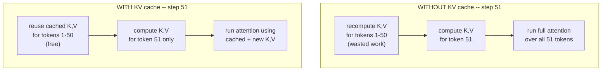
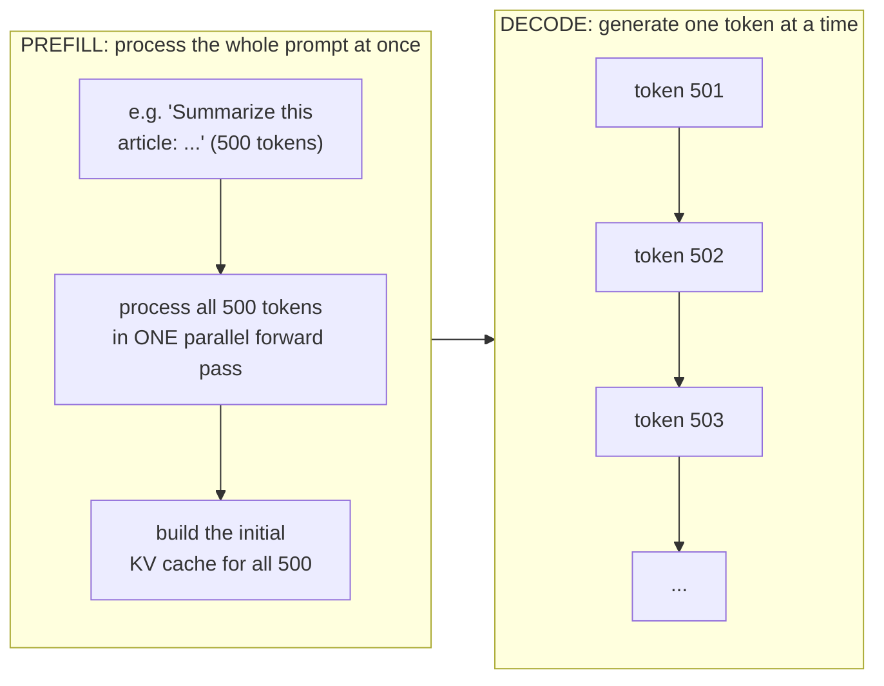
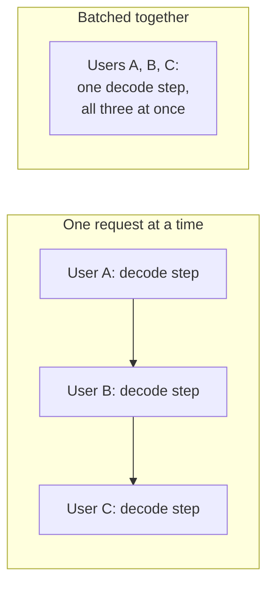
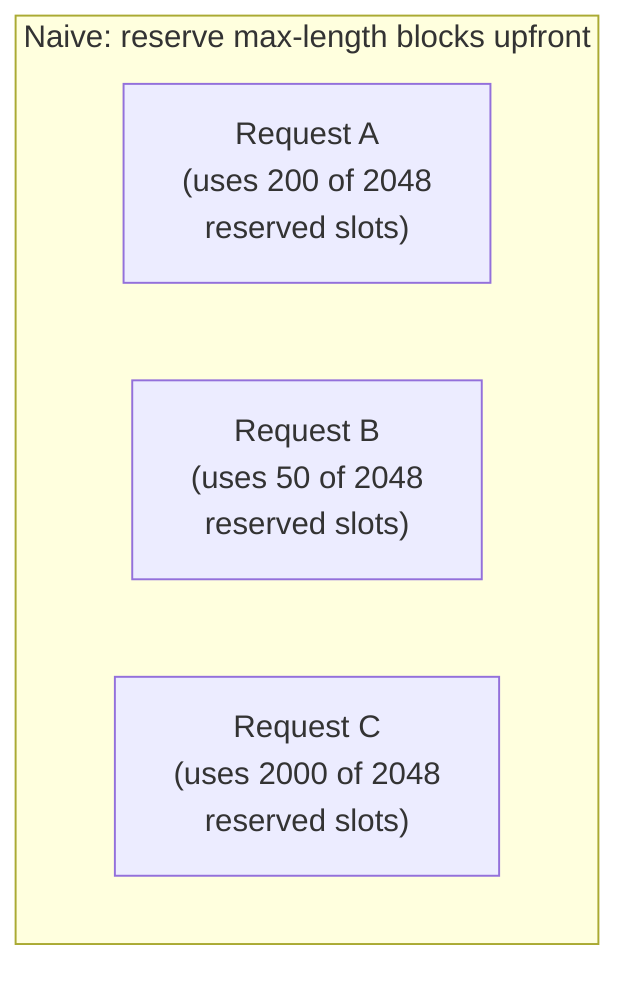
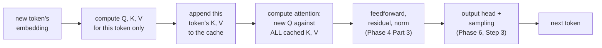

# Phase 7 — LLM Inference Internals

*Phase 6 ended on a problem: naive autoregressive generation re-runs the entire model on the entire sequence for every single new token. This phase is about eliminating that waste — everything vLLM does in Phases 8-9 is a direct response to what you learn here.*

---

## Step 1: The KV Cache — The Most Important Optimization

Recall from Phase 4 Part 2: computing attention requires a Query, Key, and Value vector for every token. When generating token 51 after already generating tokens 1-50, the Keys and Values for tokens 1-50 are **exactly the same as they were in the previous step** — nothing about them changed. Recomputing them from scratch every single step is pure waste.

**The fix:** cache the Key and Value vectors for every token, the first time they're computed, and simply reuse them for every future step. Only the *new* token needs a fresh Query, Key, and Value computed.

**The trade-off:** this saves an enormous amount of *compute*, at the cost of *memory* — the cache has to store a Key and Value vector for every token, in every layer, in every attention head, for the entire conversation. For long conversations with large models, this cache can become bigger than the model's own weights. **This memory cost is the single problem that PagedAttention (Phase 8) exists to solve.**

---

## Step 2: Prefill vs Decode — Two Phases, Two Personalities

Every generation request actually runs through two distinct phases with very different performance characteristics:

| | Prefill | Decode |
|---|---|---|
| **What it processes** | The entire input prompt, all at once | One new token at a time |
| **Parallelism** | Highly parallel — like training (Phase 6, Step 5) | Sequential — each token needs the previous one |
| **Bottleneck** | Compute-bound (lots of matrix multiplication to do) | Memory-bound (mostly waiting on reading the KV cache) |
| **GPU utilization** | High — GPU stays busy | Low per-request — GPU often waits on memory access |

This distinction matters enormously for serving systems: **prefill and decode want different things from the hardware**, and a big part of what a serving engine like vLLM does is juggle both phases efficiently, often for many different requests at once (Phase 8).

---

## Step 3: Batching — Why Handle Multiple Requests at Once?

A single decode step is memory-bound, not compute-bound (Step 2) — meaning the GPU spends more time waiting on memory than actually computing. This means there's spare compute capacity sitting idle during decode. **Batching** puts it to use: instead of running decode for one user's request at a time, process many users' next-token predictions in the same forward pass.

This is why LLM APIs can serve many simultaneous users far more efficiently than running separate copies of the model per user — batching amortizes the GPU's memory-bound bottleneck across many requests. **Continuous batching** (Phase 8) takes this further, letting new requests join a batch mid-stream rather than waiting for the whole batch to finish.

---

## Step 4: Memory Layout — Why Fragmentation Hurts

The KV cache (Step 1) needs to store a growing, unpredictable amount of data per request — you don't know in advance how long a user's conversation will get. A naive implementation reserves one large contiguous block of memory per request, sized for the *maximum* possible length.

Most of that reserved space sits empty and unusable by anyone else — memory is fragmented and wasted, exactly the way a hard drive fragments when files of different sizes get scattered around. This is precisely the problem **PagedAttention (Phase 8)** solves, by borrowing an idea from operating systems: instead of one contiguous block per request, allocate memory in small fixed-size pages, on demand, from a shared pool.

---

## Step 5: A Single Decode Step, Carefully

Putting Steps 1-4 together, here's what actually happens to generate one new token, in a serving system with a KV cache:

Only step B does new work proportional to a single token. Step D reads the entire cache but doesn't recompute it. This is the entire reason decode is fast per-step even for very long conversations — as long as the memory to hold that cache is managed well (Phase 8).

---

## Checkpoint

1. In your own words, what problem does the KV cache solve, and what does it cost in exchange?
2. Why is prefill compute-bound while decode is memory-bound?
3. Why does batching help specifically because decode is memory-bound?
4. Explain the memory fragmentation problem using the "reserved parking spot" analogy in your own words.
5. In a single decode step, which part of the computation is proportional to just one token, and which part touches the whole cache?

## Resources

- Hugging Face - LLM Inference at scale with vLLM (blog): https://huggingface.co/blog/vllm
- vLLM team - Efficient Memory Management for LLM Serving with PagedAttention (paper): https://arxiv.org/abs/2309.06180
- Kipply's blog - Transformer Inference Arithmetic: https://kipp.ly/transformer-inference-arithmetic/
