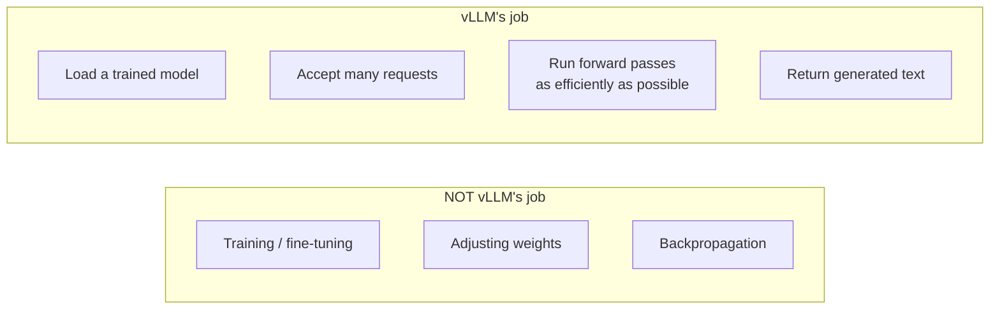
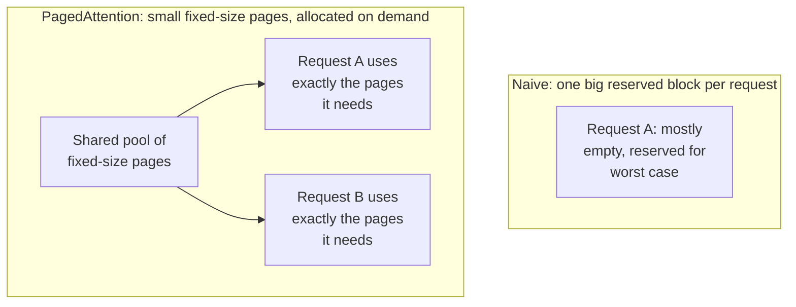
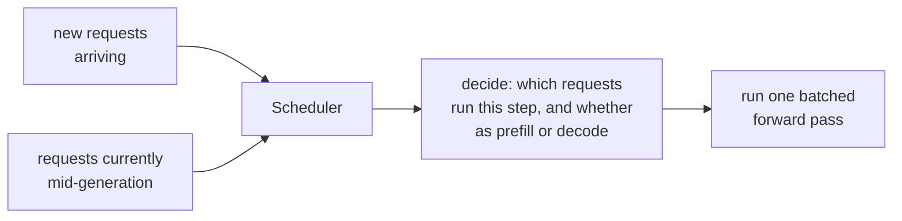
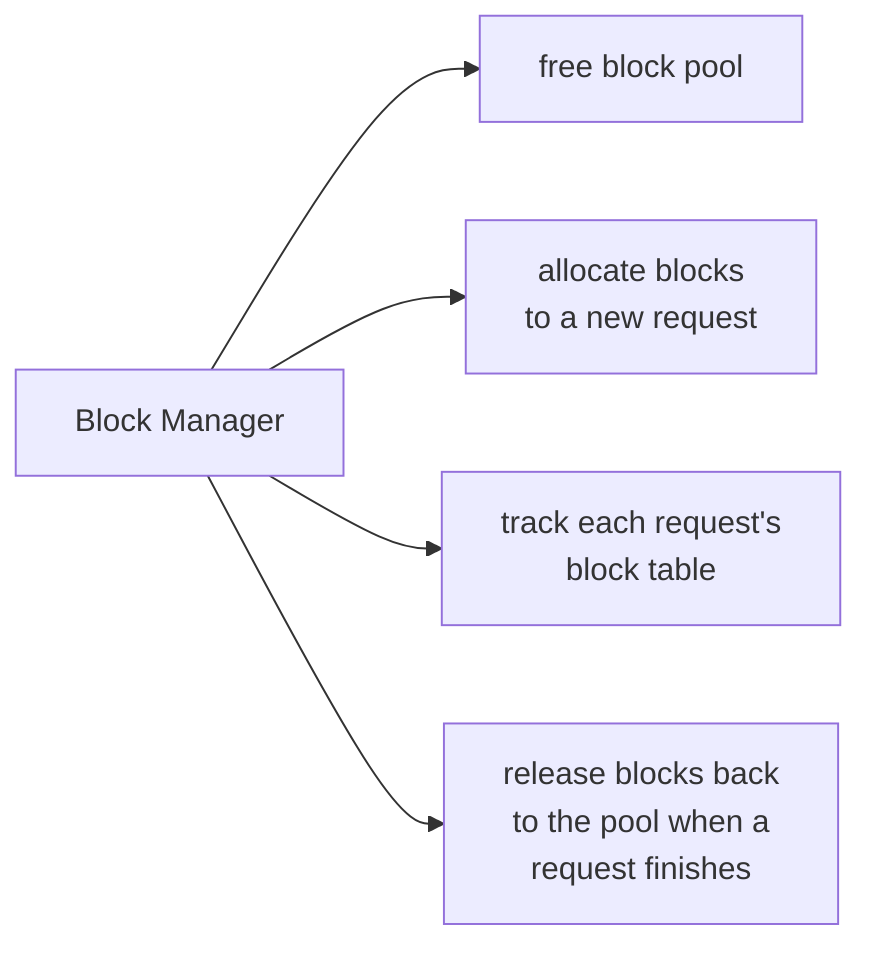
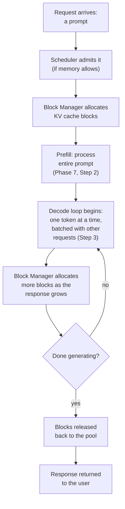

# Phase 8 — vLLM Architecture

*Phase 7 introduced the KV cache, the prefill/decode split, batching, and memory fragmentation. vLLM is a serving system built entirely around solving those problems well. Every idea in this phase is a direct answer to something you already understand.*

---

## Step 1: What vLLM Is (and Isn't)

vLLM is an **inference engine** — it serves an already-trained model efficiently to many users at once. Recall the training vs inference distinction from Phase 1, Step 5 and Phase 6, Step 5: vLLM never trains anything, adjusts no weights, and runs no backpropagation. Its entire job is running the forward pass (Phase 1, Step 5) as fast and as cheaply as possible, for as many simultaneous requests as possible.

vLLM is built around three big ideas, each solving one problem from Phase 7: **PagedAttention** (fixes memory fragmentation), **continuous batching** (extends the batching idea to handle requests arriving and finishing at different times), and **a scheduler** that decides what work happens when.

---

## Step 2: PagedAttention — The Headline Idea

Recall Phase 7, Step 4: the naive way to store the KV cache reserves one large contiguous block per request, sized for the worst case, wasting most of that memory. **PagedAttention** borrows a decades-old idea from operating systems — **virtual memory paging** — and applies it to the KV cache.

Instead of one contiguous block, the KV cache is split into small fixed-size **blocks** (or "pages"), pulled from a shared pool only as a request actually generates more tokens. A request's KV cache can even live in **non-contiguous** memory — scattered blocks — with a lookup table (a "block table") tracking which physical blocks belong to which request, exactly like a page table in an operating system.

**Why this matters:** memory is used almost to its actual limit, not its worst-case limit, meaning vLLM can fit far more simultaneous requests in the same amount of GPU memory than a naive implementation could.

---

## Step 3: The Scheduler

The scheduler is the component deciding, at every step, which requests get to run and in what phase (prefill or decode, Phase 7 Step 2). New requests arrive constantly, existing requests are mid-generation, and GPU memory is finite — the scheduler's job is to maximize throughput without running out of memory.

**Continuous batching** (mentioned in Phase 7, Step 3) is what the scheduler enables: rather than waiting for an entire batch of requests to all finish before starting a new batch, finished requests are immediately swapped out and new requests swapped in, keeping the GPU continuously busy instead of waiting on the slowest request in a batch.

---

## Step 4: The Block Manager / KV Cache Manager

If PagedAttention (Step 2) is the *idea*, the **block manager** is the component that actually implements it — tracking which physical memory blocks are free, which are in use, and which request's block table points to which physical blocks.

This is directly analogous to how an operating system's memory manager tracks physical memory pages — the same conceptual machinery, applied to GPU memory instead of RAM.

---

## Step 5: High-Level Request Flow

Putting Steps 1-4 together, here's what happens when a request arrives:

---

## Step 6: Engine Components in the Codebase

At a high level, vLLM's codebase mirrors the concepts above. You don't need to read code yet (that's Phase 9), but it helps to know the map before diving in:

| Concept from this phase | Rough area of the codebase |
|---|---|
| Scheduler (Step 3) | Decides batch composition every step |
| Block Manager (Step 4) | Tracks physical KV cache blocks |
| PagedAttention (Step 2) | Implemented inside the attention backend itself |
| Request flow (Step 5) | Orchestrated by a top-level "engine" object |

Phase 9 goes one level deeper than this — actually opening the attention backend and tracing a single token's forward pass through real code.

---

## Checkpoint

1. In one sentence, what is vLLM's job, and what is explicitly not its job?
2. Explain PagedAttention using the operating-system paging analogy, in your own words.
3. Why does continuous batching keep the GPU busier than naive fixed-size batching?
4. What does the block manager track, and why is that necessary for PagedAttention to work?
5. Walk through the full request lifecycle from arrival to response, naming each component involved.

## Resources

- vLLM team - Efficient Memory Management for LLM Serving with PagedAttention (paper): https://arxiv.org/abs/2309.06180
- vLLM official documentation: https://docs.vllm.ai/
- vLLM GitHub repository: https://github.com/vllm-project/vllm
