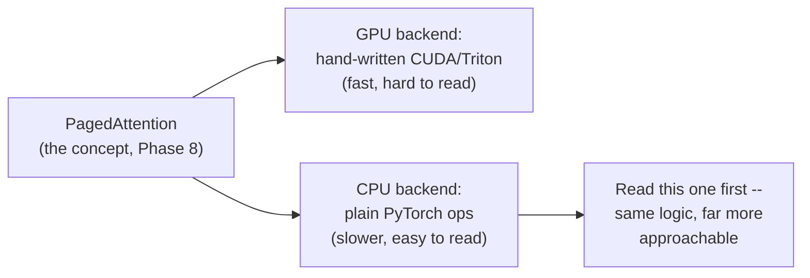
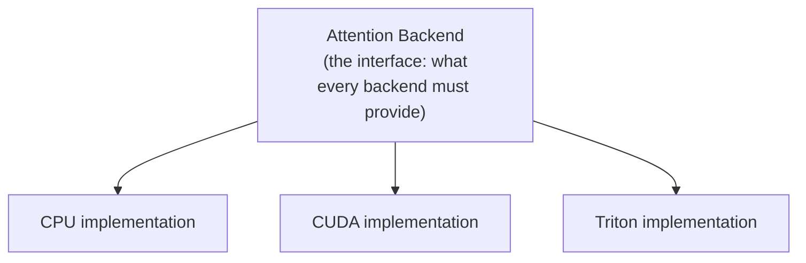
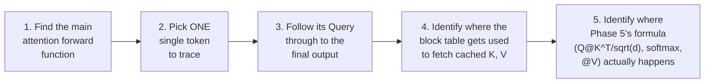
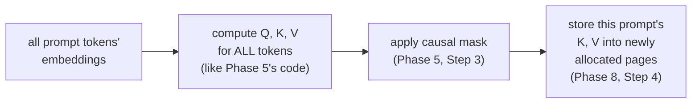
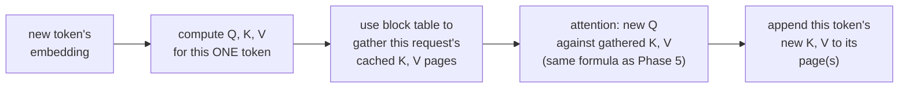

# Phase 9 — Attention Implementation in vLLM (CPU Mode)

*The destination. Everything from Phase 1 through Phase 8 was preparation for this: opening vLLM's actual source code and tracing a real attention forward pass, tensor by tensor, until you can explain every line.*

---

## Step 1: Why CPU Mode Specifically

vLLM's GPU backend uses hand-written CUDA/Triton kernels (Phase 11 territory) — extremely fast, but written in a style optimized for hardware efficiency, not readability. The **CPU backend** implements the exact same PagedAttention logic (Phase 8, Step 2) using plain, readable PyTorch operations you already know from Phase 2 and Phase 5.

Reading the CPU backend first means you can map every line back to concepts from Phases 2, 5, 7, and 8, without CUDA syntax getting in the way. Once this clicks, the GPU kernels become "the same thing, written for speed" rather than a wall of unfamiliar code.

---

## Step 2: The Attention Backend Abstraction

vLLM doesn't hard-code one single attention implementation — it defines an abstraction (an interface) that different backends (CPU, GPU/CUDA, GPU/Triton) each implement. This is a common software engineering pattern: define *what* an attention backend must do, then let different implementations decide *how*.

Every backend must answer the same core question, using the same conceptual pieces you already know: given cached Keys and Values (Phase 7, Step 1) stored in pages (Phase 8, Step 2), and a new Query, compute the attention output.

---

## Step 3: The Tensor Shapes You'll See

Before opening any code, know what to expect. These shapes are direct extensions of what you built by hand in Phase 5:

| Tensor | Typical shape | What it holds |
|---|---|---|
| Query | `(num_tokens, num_heads, head_dim)` | The new token(s) being processed this step |
| Key/Value cache | `(num_blocks, block_size, num_heads, head_dim)` | The paged cache from Phase 8 — note the block structure instead of one flat sequence dimension |
| Block table | `(num_requests, max_blocks_per_request)` | Which physical blocks belong to which request (Phase 8, Step 4) |
| Output | `(num_tokens, num_heads, head_dim)` | Same shape as Query — one output vector per input token |

**The one genuinely new idea here versus Phase 5:** your hand-built version assumed one contiguous `(seq_len, dim)` tensor per request. Real vLLM code instead gathers scattered blocks using the block table before doing essentially the same Query-Key-Value math you already wrote.

---

## Step 4: Reading Strategy — Trace One Token

Don't try to read the whole file top to bottom. Instead:

Print statements are your friend here, exactly like Phase 5's advice: clone the repo, add `print(tensor.shape)` at a few points inside the CPU attention function, run a tiny example, and watch the shapes evolve.

---

## Step 5: Mental Model — Prefill on CPU

Recall Phase 7, Step 2: prefill processes the entire prompt at once. In the CPU backend, this looks like a fairly direct version of the multi-head attention you built in Phase 5 — full Query-Key-Value computed for every token in the prompt, with causal masking (Phase 5, Step 3) applied, since even prefill can't let earlier tokens see later ones.

---

## Step 6: Mental Model — Decode on CPU

Recall Phase 7, Step 5: decode computes Q, K, V for only the new token, then attends against the *entire* cached history. In the CPU backend, this means gathering K and V from potentially scattered pages (via the block table) before running attention.

**The key realization this phase is building toward:** there is no new math here. It's the exact formula from Phase 5, Step 2 — `softmax(QK^T / sqrt(d_k)) @ V` — wrapped in extra bookkeeping (Steps 3-4 above) to handle paged, non-contiguous memory instead of one flat tensor.

---

## Step 7: What to Deliberately Ignore (for now)

On a first read, skip these — they're real, but not necessary to understand the core loop:

- Quantization-specific code paths (Phase 11)
- Multi-GPU / distributed-specific branches (Phase 11)
- Performance micro-optimizations (vectorization tricks, SIMD-specific code) that don't change the underlying algorithm
- Speculative decoding hooks (Phase 11)

Understand the plain single-request, single-GPU-worth-of-work path first. Everything else is a variation on this core.

---

## Step 8: A Debugging Recipe

If you get lost while reading:

1. Clone vLLM locally and find the CPU attention backend file.
2. Write the smallest possible script: load a tiny model, send one short prompt, force CPU mode.
3. Add `print(f"{tensor_name}.shape = {tensor.shape}")` at each major step.
4. Run it, and match what you see against Steps 3, 5, and 6 above.
5. Whenever a shape surprises you, that's exactly the place to slow down and read the surrounding code closely — it usually means paged memory is doing something Phase 5's simple version never had to handle.

---

## Checkpoint

1. Why is the CPU backend a better first read than the GPU/CUDA backend, even though it's slower?
2. What is an "attention backend abstraction," and why would a codebase be designed this way?
3. What's the one new tensor (versus Phase 5) that shows up because of paged memory, and what does it do?
4. In your own words, explain what's genuinely new in vLLM's attention code versus what you built in Phase 5.
5. Name two things this phase deliberately tells you to ignore on a first pass, and why.

## Resources

- vLLM GitHub repository (source code): https://github.com/vllm-project/vllm
- vLLM official documentation: https://docs.vllm.ai/
- vLLM team - Efficient Memory Management for LLM Serving with PagedAttention (paper): https://arxiv.org/abs/2309.06180
