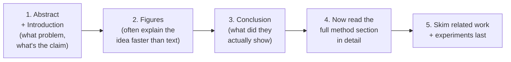

# Phase 10 — Research Papers, Read Gradually

*Don't start a learning journey here — papers reward you only after you've built intuition. Now that Phases 1-9 are done, these same papers will read completely differently than if you'd opened them on day one.*

---

## 10.1 — How to Read an ML Paper

Papers are not written to teach beginners — they're written for other researchers who already share the same background. A useful reading order, different from reading top to bottom:

**Read for the idea first, the math second.** Your job on a first pass is to answer: what problem existed before this paper, what's the one new idea, and why does it work. The exact derivations matter on a second pass, once the shape of the idea is already in your head — which, after Phases 1-9, it usually will be.

---

## 10.2 — The Essential Five

These five papers map directly onto phases you've already completed. Read them in this order:

| Paper | Maps to | What to look for |
|---|---|---|
| **Vaswani et al. (2017) — Attention Is All You Need** https://arxiv.org/abs/1706.03762 | Phase 4 (all parts) | You built every piece of this paper by hand already (Phase 5). Read it now to see the *original* notation and the ablation experiments showing why each piece matters. |
| **Radford et al. (2018) — Improving Language Understanding by Generative Pre-Training (GPT-1)** https://cdn.openai.com/research-covers/language-unsupervised/language_understanding_paper.pdf | Phase 6 | The first paper to combine "decoder-only transformer" + "pretrain on huge text, then fine-tune" — the recipe every modern LLM still follows. |
| **Radford et al. (2019) — Language Models are Unsupervised Multitask Learners (GPT-2)** https://cdn.openai.com/better-language-models/language_models_are_unsupervised_multitask_learners.pdf | Phase 6, Step 4-5 | Shows that scaling up a decoder-only model, with no task-specific fine-tuning at all, produces surprisingly general capability — the paper that made "just scale it up" a serious strategy. |
| **Su et al. (2021) — RoFormer / RoPE: Rotary Position Embedding** https://arxiv.org/abs/2104.09864 | Phase 4, Step 3 (Positional Encoding) | A different, now widely-used alternative to the sinusoidal encoding you learned — instead of adding a position vector, it *rotates* the Query and Key vectors based on position. Compare it directly against what you already know. |
| **Dao et al. (2022) — FlashAttention** https://arxiv.org/abs/2205.14135 | Phase 11.1, Phase 9 | You've already met the conceptual version of this (Phase 11.1) — reading the actual paper now will make far more sense having already traced real attention code in Phase 9. |

---

## 10.3 — Bonus Reading (Highly Recommended)

Once the essential five feel comfortable, these round out the picture:

- **Kaplan et al. (2020) — Scaling Laws for Neural Language Models** — https://arxiv.org/abs/2001.08361 — the paper that made "bigger model + more data = predictably better" a quantifiable, plannable strategy rather than a guess.
- **Ouyang et al. (2022) — Training language models to follow instructions with human feedback (InstructGPT)** — https://arxiv.org/abs/2203.02155 — the RLHF paper; explains the fine-tuning step (Phase 1, Step 3) that turns a raw next-token predictor into an assistant that follows instructions.
- **Kwon et al. (2023) — Efficient Memory Management for Large Language Model Serving with PagedAttention** — https://arxiv.org/abs/2309.06180 — the actual vLLM paper. You met this concept in Phase 8; now read the source directly, you have every prerequisite.

---

## A Note on Pace

This phase is intentionally open-ended — there's no checkpoint quiz here, because "understanding a paper" isn't a single fact you can quiz yourself on. A reasonable cadence: one paper a week, read twice (once for the idea, once for the detail), with notes written in your own words rather than copied from the paper. If you can explain a paper's core idea to someone else without looking at it, you've actually understood it.

## Resources

- Andrej Karpathy's paper reading approach (mentioned throughout his videos referenced in earlier phases) — read the abstract, skim figures, then decide how deep to go.
- arXiv Sanity / Papers with Code — useful for finding follow-up papers once you've read one of the essential five and want to see what came after.
