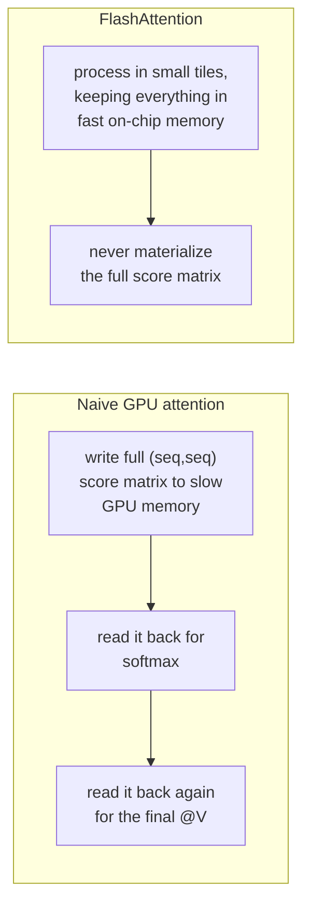
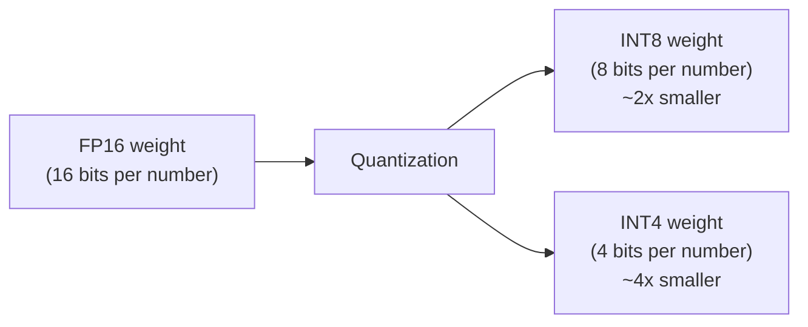
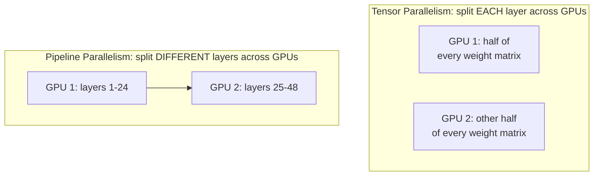
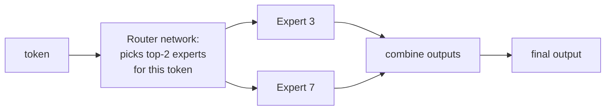
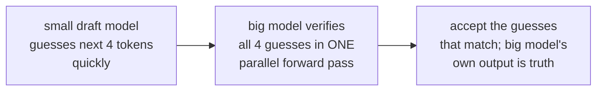
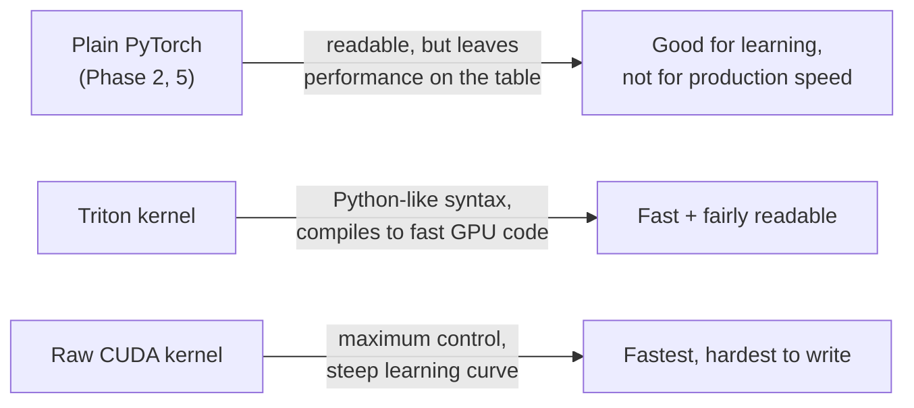

# Phase 11 — Advanced Topics

*Past the destination (Phase 9). These are real-world topics you'll run into once you start working with LLMs in production. Pick what you need — this phase isn't meant to be read start to finish like Phases 1-9.*

---

## 11.1 — FlashAttention & IO-Aware Kernels

Recall Phase 9: vLLM's CPU backend computes attention with plain, readable PyTorch ops. In production, GPU kernels use a smarter approach called **FlashAttention**, which doesn't change the *math* (still `softmax(QK^T/sqrt(d_k))V` from Phase 5) — it changes *how* that math touches memory.

**The insight:** GPUs have a small amount of very fast memory (on-chip) and a large amount of slower memory (HBM). Naive attention writes the full `(seq_len, seq_len)` score matrix to slow memory and reads it back multiple times — for long sequences this is the actual bottleneck, more than the raw compute. FlashAttention restructures the computation into small tiles that fit in fast memory, producing the mathematically identical result while touching slow memory far less. This is why it's called "IO-aware" — it's optimizing memory movement, not the formula itself.

---

## 11.2 — Quantization

A model's weights are normally stored as 32-bit or 16-bit floating point numbers. **Quantization** compresses them into fewer bits (commonly 8-bit or 4-bit integers), trading a small amount of precision for a large reduction in memory and often faster computation.

**Why this matters for serving:** recall Phase 7 — the KV cache and model weights compete for the same limited GPU memory. A quantized model leaves more memory free for the KV cache (Phase 7, Step 1), meaning vLLM can serve more simultaneous requests, or handle longer context windows (Phase 6, Step 6), on the same hardware. The trade-off is a small, usually acceptable, drop in output quality.

---

## 11.3 — Tensor Parallelism & Pipeline Parallelism

Some models are too large to fit on a single GPU at all. Two different strategies split a model across multiple GPUs:

- **Tensor parallelism** splits individual weight matrices (like the ones in Phase 4's attention and feedforward layers) across GPUs — every GPU works on part of every layer, communicating constantly.
- **Pipeline parallelism** instead gives each GPU a different range of whole transformer blocks (Phase 4 Part 3) — GPU 1 handles the first 24 blocks, GPU 2 the next 24, and so on, passing activations down the line like an assembly line.

Real large-scale serving often combines both, plus data parallelism (running multiple full copies of the model for different requests) — a topic sometimes called "3D parallelism."

---

## 11.4 — Mixture of Experts (MoE)

Instead of every token passing through the *same* feedforward network (Phase 4 Part 3, Step 2), an MoE model has many separate feedforward networks ("experts"), and a small router network picks a handful of experts to use for each individual token.

**Why this is attractive:** the model can have a huge total number of parameters (many experts), while only activating a small fraction of them per token — giving some of the benefits of a much bigger model at a fraction of the per-token compute cost. The trade-off is complexity: routing, load-balancing across experts, and memory management all get harder, which is part of why MoE-aware serving is an active area of engineering.

---

## 11.5 — Speculative Decoding

Recall Phase 7, Step 2: decode generates one token at a time and is memory-bound, not compute-bound — meaning there's spare compute sitting idle at each step. **Speculative decoding** puts that spare compute to use with a clever trick: a small, fast "draft" model guesses several tokens ahead, and the big model checks all of those guesses in a single parallel pass instead of one sequential pass per token.

If the draft model's guesses are good, the big model effectively generates several tokens for the cost of one decode step, since verifying a guess is cheap compared to generating one from scratch. If a guess turns out wrong, only the correct tokens are kept — output quality is identical to normal decoding, only faster.

---

## 11.6 — CUDA & Triton Kernels

FlashAttention (11.1) and PagedAttention's GPU implementation (Phase 8, Step 2) aren't written in plain PyTorch — they're written as custom **kernels**, using either raw CUDA (Nvidia's low-level GPU programming language) or **Triton** (a Python-like language that compiles down to efficient GPU code, easier to write and read than raw CUDA).

You don't need to write these yourself to use vLLM effectively, but recognizing this layer explains why the GPU backend (which Phase 9 told you to set aside in favor of the CPU backend) looks so different from the readable code you traced — it's the same math, compiled for raw speed instead of readability.

---

## 11.7 — Recommended Practical Projects

Once the topics above make sense conceptually, these projects turn that understanding into hands-on skill:

1. **Quantize a small model yourself** using a library like `bitsandbytes`, and measure the memory savings directly.
2. **Benchmark vLLM vs a naive Hugging Face `generate()` loop** on the same model and prompt set — measure tokens/second and memory usage, and connect the difference back to Phases 7-8.
3. **Implement a toy version of speculative decoding**: use a small model to draft tokens, and a larger model to verify them, on a task simple enough to check correctness by eye.
4. **Read vLLM's MoE-specific code** (if using a MoE model like Mixtral) and compare it against the conceptual diagram in 11.4.

---

## Checkpoint

1. What problem does FlashAttention solve, if not the underlying math itself?
2. Why does quantization help vLLM serve more requests, even though it doesn't touch the KV cache directly?
3. What's the practical difference between tensor parallelism and pipeline parallelism?
4. Why can MoE models have huge total parameter counts while staying cheap to run per token?
5. Why doesn't speculative decoding risk lowering output quality, even though it "guesses" ahead?

## Resources

- Dao et al. (2022) — FlashAttention paper: https://arxiv.org/abs/2205.14135
- Hugging Face — Quantization overview: https://huggingface.co/docs/transformers/quantization/overview
- Narayanan et al. — Efficient Large-Scale Language Model Training (parallelism): https://arxiv.org/abs/2104.04473
- Fedus et al. — Switch Transformers (MoE): https://arxiv.org/abs/2101.03961
- Leviathan et al. — Speculative Decoding paper: https://arxiv.org/abs/2211.17192
- Triton language documentation: https://triton-lang.org/
