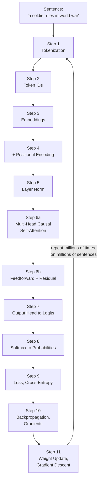
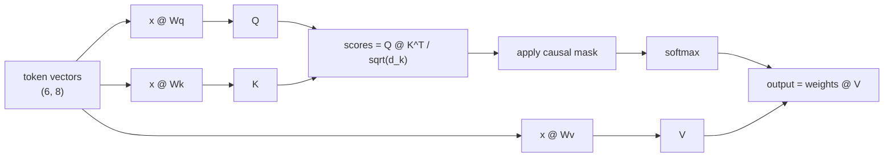

# Worked Example, Part 1: Training on "a soldier dies in world war"

*Every previous phase explained one piece at a time. This is the payoff: one real sentence, traced through EVERY step, with real numbers from an actual run of the code below, tokenization, embeddings, attention, logits, loss, gradients, and the weight update. Nothing here is made up; every number was produced by actually running this exact script.*

Copy the full script at the bottom into Colab and run it yourself. The numbers below are what it prints.

---

## The setup

- Sentence: "a soldier dies in world war"
- Toy vocabulary (12 words, tiny on purpose): a, soldier, dies, in, world, war, gun, was, fired, at, the, eos
- Embedding dimension: D=8 (real models use 768-12288+; we use 8 so every vector fits on screen)
- Heads: 2, each of dimension 4
- One transformer block, causal masked

---

## The Full Pipeline at a Glance



Every box above is one section below, with real numbers from an actual run.

---

## Step 1: Tokenization (Phase 4, Step 1)

```
Sentence: a soldier dies in world war
Tokens:   ['a', 'soldier', 'dies', 'in', 'world', 'war']
```

We split on whole words here purely for readability. A real tokenizer (BPE) would likely split some of these into sub-word pieces.

---

## Step 2: Token IDs (Phase 4, Step 1)

```
Vocabulary: {'a': 0, 'soldier': 1, 'dies': 2, 'in': 3, 'world': 4, 'war': 5,
             'gun': 6, 'was': 7, 'fired': 8, 'at': 9, 'the': 10, '<eos>': 11}
Token IDs for sentence: [0, 1, 2, 3, 4, 5]
```

Six words became six integers.

---

## Step 3: Embeddings (Phase 4, Step 2)

Formula: for token id t, look up row t of the embedding table E (shape vocab_size x D).

E[t] = embedding vector for token t

```
Shape: torch.Size([6, 8])
Embedding for 'a' (first token):
tensor([ 1.9269,  1.4873,  0.9007, -2.1055,  0.6784, -1.2345, -0.0431, -1.6047])
```

Each of the 6 tokens now has an 8-number vector, randomly initialized since this is an untrained model.

---

## Step 4: Positional Encoding (Phase 4, Step 3)

Formula: x = token_embedding + positional_embedding

```python
x = tok_emb + pos_emb   # shape (6, 8)
```

Each token's embedding gets a position-dependent vector added to it, so the model can tell "a" at position 0 apart from "a" if it appeared again at position 4.

---

## Step 5: Layer Norm (Phase 4 Part 3, Step 4)

Formula for each token vector x, with learned scale gamma and shift beta:

LayerNorm(x) = gamma * (x - mean(x)) / sqrt(variance(x) + epsilon) + beta

```
Mean of first token vector after norm (~0): 0.00000003
Std of first token vector after norm (~1):  0.9999979
```

Before attention, every token vector gets re-centered to mean approximately 0 and spread approximately 1.

---

## Step 6a: Multi-Head Causal Self-Attention (Phase 4, Step 4-6 / Phase 5)

Formula:

Attention(Q, K, V) = softmax( (Q @ K_transposed) / sqrt(d_k) ) @ V

Where Q, K, V come from the input x via three learned weight matrices:

Q = x @ W_q
K = x @ W_k
V = x @ W_v



Here are the real attention weights for head 0, rows are query positions, columns are key positions:

```
tensor([[1.0000, 0.0000, 0.0000, 0.0000, 0.0000, 0.0000],
        [0.6012, 0.3988, 0.0000, 0.0000, 0.0000, 0.0000],
        [0.4285, 0.2473, 0.3242, 0.0000, 0.0000, 0.0000],
        [0.3182, 0.1962, 0.3288, 0.1569, 0.0000, 0.0000],
        [0.1708, 0.1396, 0.2475, 0.1672, 0.2750, 0.0000],
        [0.1755, 0.1042, 0.1636, 0.1538, 0.2745, 0.1284]])
```

Row 1 is 'a', which can only see itself. Row 6 is 'war', seeing all 6 tokens. Every value in the upper-right triangle is exactly 0.0000, this is the causal mask working exactly as designed. Each row still sums to 1.0.

---

## Step 6b: Feedforward + Residual (Phase 4 Part 3, Step 2-3)

Formulas:

x = x + Attention(LayerNorm(x))          (residual around attention)
FFN(x) = W2 @ GELU(W1 @ x + b1) + b2
x = x + FFN(LayerNorm(x))                 (residual around feedforward)

```
Block output shape (context vectors): torch.Size([6, 8])
Context vector for 'world' (5th token):
tensor([ 0.4331,  0.3803, -1.4400,  0.7691,  0.1799,  1.8056,  0.9992, -0.1803])
```

This is the context vector for "world", an 8-number summary that has absorbed information from every token up to and including itself, then been reshaped by the feedforward network.

---

## Step 7: Output Head to Logits (Phase 6, Step 3)

Formula:

logits = final_hidden_vector @ W_output + b_output

```
Logits shape: torch.Size([6, 12])
Logits after 'in' (predicting the 5th word):
tensor([ 0.3133, -1.0535,  0.0055, -0.7986,  0.6227, -0.2805,  0.6865,  0.7229,
        -1.0571, -1.4093,  0.1964,  0.9965])
```

One raw score per vocabulary word, produced by projecting the context vector up to vocabulary size.

---

## Step 8: Softmax to Probabilities (Phase 2, Step 3 / Phase 6, Step 3)

Formula, for logit z_i out of K total vocabulary words:

softmax(z_i) = exp(z_i) / sum of exp(z_j) for all j from 1 to K

```
(after seeing "a soldier dies in", probability of each possible next word)
  a       : 0.0953
  soldier : 0.0243
  dies    : 0.0700
  in      : 0.0313
  world   : 0.1298   <- the CORRECT answer, but not yet the highest!
  war     : 0.0526
  gun     : 0.1384
  was     : 0.1435
  fired   : 0.0242
  at      : 0.0170
  the     : 0.0848
  <eos>   : 0.1887   <- currently the model's top guess (wrong)
```

The correct next word is "world" (0.1298), but the untrained model currently thinks eos (0.1887) is slightly more likely.

---

## Step 9: Loss, Cross-Entropy (Phase 6, Step 5)

Formula, for the correct token's predicted probability p_correct:

Loss = -log(p_correct)

Averaged across every position being predicted in the sentence.

```
Predicting these next tokens: ['soldier', 'dies', 'in', 'world', 'war']
Loss value: 2.5752
```

One single number summarizing how wrong the model's predictions were across all 5 positions at once. Lower is better; a perfect model would approach 0.

---

## Step 10: Backpropagation, Gradient Calculation (Phase 1, Step 4)

Formula, the clean gradient at the output layer, where p is the predicted probability vector and y is the one-hot true label:

dLoss/dLogits = p - y

This then flows backward through every earlier layer via the chain rule:

dLoss/dW_earlier_layer = dLoss/dOutput * dOutput/dW_earlier_layer

```
Gradient of the loss w.r.t. output_head weight matrix, shape: torch.Size([12, 8])
First row of that gradient (first vocab word's weight gradients):
tensor([-0.0289,  0.0446, -0.0613,  0.0075, -0.0111,  0.0355, -0.0303,  0.0440])
Gradient norm across the whole output head: 1.2486

Gradient also flowed back into earlier layers, e.g. q_proj weight gradient norm: 0.0880
```

loss.backward() computed, for every single weight in the entire network, exactly how much that weight contributed to the loss being 2.5752 rather than 0.

---

## Step 11: Weight Update, Gradient Descent (Phase 1, Step 4)

Formula, for every weight W with learning rate lr:

W_new = W_old - lr * dLoss/dW

```
output_head weight, row 0, first 4 values, BEFORE update:
tensor([-0.3468, -0.0438, -0.2411,  0.0659])
output_head weight, row 0, first 4 values, AFTER update:
tensor([-0.3439, -0.0483, -0.2350,  0.0651])
```

Every single weight in the model got nudged slightly. Real training repeats this exact loop millions or billions of times, across a huge dataset.

---

## The Full Script (copy this into Colab and run it yourself)

```python
import torch
import torch.nn as nn
import torch.nn.functional as F

torch.manual_seed(42)
torch.set_printoptions(precision=4, sci_mode=False)

sentence = "a soldier dies in world war"
words = sentence.split()
print("STEP 1 - Tokenization")
print("Sentence:", sentence)
print("Tokens:", words)
print()

vocab = ["a", "soldier", "dies", "in", "world", "war",
         "gun", "was", "fired", "at", "the", "<eos>"]
stoi = {w: i for i, w in enumerate(vocab)}
itos = {i: w for w, i in stoi.items()}
vocab_size = len(vocab)

token_ids = torch.tensor([stoi[w] for w in words])
print("STEP 2 - Token IDs")
print("Vocabulary:", stoi)
print("Token IDs for sentence:", token_ids.tolist())
print()

D = 8
n_heads = 2
head_dim = D // n_heads

embedding_table = nn.Embedding(vocab_size, D)
tok_emb = embedding_table(token_ids)
print("STEP 3 - Token Embeddings")
print("Shape:", tok_emb.shape)
print("Embedding for 'a' (first token):", tok_emb[0].detach())
print()

T = len(words)
pos_embedding_table = nn.Embedding(T, D)
positions = torch.arange(T)
pos_emb = pos_embedding_table(positions)

x = tok_emb + pos_emb
print("STEP 4 - Add Positional Encoding")
print("x shape:", x.shape)
print()

ln1 = nn.LayerNorm(D)
x_normed = ln1(x)
print("STEP 5 - Layer Norm")
print("Mean after norm:", x_normed[0].mean().item())
print("Std after norm:", x_normed[0].std(unbiased=False).item())
print()

q_proj = nn.Linear(D, D)
k_proj = nn.Linear(D, D)
v_proj = nn.Linear(D, D)
out_proj = nn.Linear(D, D)

def multi_head_attention(x_in, causal=True):
    T_, D_ = x_in.shape
    Q = q_proj(x_in).view(T_, n_heads, head_dim).transpose(0, 1)
    K = k_proj(x_in).view(T_, n_heads, head_dim).transpose(0, 1)
    V = v_proj(x_in).view(T_, n_heads, head_dim).transpose(0, 1)

    scores = Q @ K.transpose(-2, -1) / (head_dim ** 0.5)
    if causal:
        mask = torch.triu(torch.ones(T_, T_), diagonal=1).bool()
        scores = scores.masked_fill(mask, float('-inf'))
    weights = F.softmax(scores, dim=-1)
    out = weights @ V
    out = out.transpose(0, 1).contiguous().view(T_, D_)
    return out_proj(out), weights

attn_out, attn_weights = multi_head_attention(x_normed, causal=True)
x = x + attn_out

print("STEP 6a - Multi-Head Causal Self-Attention")
print(attn_weights[0].detach())
print()

ln2 = nn.LayerNorm(D)
ffn = nn.Sequential(
    nn.Linear(D, D * 4),
    nn.GELU(),
    nn.Linear(D * 4, D),
)
ffn_out = ffn(ln2(x))
x = x + ffn_out

print("STEP 6b - Feedforward + residual")
print("Block output shape:", x.shape)
print("Context vector for 'world':", x[4].detach())
print()

final_norm = nn.LayerNorm(D)
output_head = nn.Linear(D, vocab_size)

logits = output_head(final_norm(x))
print("STEP 7 - Output Head to Logits")
print("Logits shape:", logits.shape)
print()

probs_after_in = F.softmax(logits[3], dim=-1)
print("STEP 8 - Softmax to Probabilities")
for w, p in zip(vocab, probs_after_in.detach().tolist()):
    print(f"  {w:8s}: {p:.4f}")
print()

predicted_logits = logits[:-1]
true_next_tokens = token_ids[1:]
loss = F.cross_entropy(predicted_logits, true_next_tokens)
print("STEP 9 - Loss")
print("Loss value:", loss.item())
print()

loss.backward()
print("STEP 10 - Backpropagation")
print("Output head gradient shape:", output_head.weight.grad.shape)
print("Gradient norm:", output_head.weight.grad.norm().item())
print()

lr = 0.1
before = output_head.weight[0, :4].clone()

with torch.no_grad():
    for p in list(output_head.parameters()) + list(q_proj.parameters()) + \
              list(k_proj.parameters()) + list(v_proj.parameters()) + \
              list(ffn.parameters()) + list(embedding_table.parameters()):
        if p.grad is not None:
            p -= lr * p.grad

after = output_head.weight[0, :4].clone()

print("STEP 11 - Weight Update")
print("BEFORE:", before)
print("AFTER: ", after)
```

---

## Checkpoint

1. Why is the upper-right triangle of the attention weight grid all zeros?
2. What real quantity does "loss = 2.5752" represent, in your own words?
3. Write the gradient descent formula from memory: how does a new weight relate to the old weight and the gradient?
4. Which layers received gradients during backprop, only the output head, or earlier layers too? Why?

Continue to Part 2: Inference with a real KV cache (02-inference-walkthrough.md)
