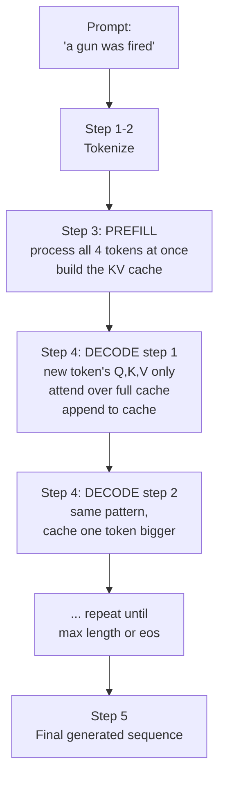
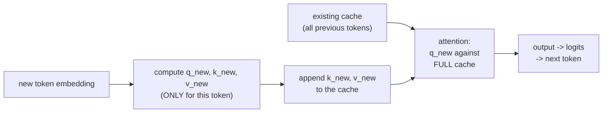

# Worked Example, Part 2: Inference on "a gun was fired" (with a real KV cache)

*Part 1 traced training on one sentence. This traces the OTHER half of the model's life: generating new text from a prompt, using a real, working KV cache, not just the concept from Phase 7, but actual code that builds and reuses one, with real printed output at every step.*

Copy the full script at the bottom into Colab and run it yourself.

---

## The setup

Same toy model shape as Part 1 (D=8, 2 heads, same 12-word vocabulary), with freshly random-initialized weights.

Prompt: "a gun was fired"

---

## The Full Pipeline at a Glance



Prefill happens once, in parallel, for the whole prompt. Every step after that is decode, one new token at a time, reusing everything computed before.

---

## Step 1-2: Tokenize the Prompt (Phase 4, Step 1)

```
Prompt: a gun was fired
Tokens: ['a', 'gun', 'was', 'fired']
Token IDs: [0, 6, 7, 8]
```

Same mechanism as Part 1, words become integers using the same vocabulary table.

---

## Step 3: Prefill, Process the Whole Prompt at Once (Phase 7, Step 2)

Formula, same attention formula as training, but computed once for ALL prompt tokens together, and their K and V get saved:

Q, K, V = x @ Wq, x @ Wk, x @ Wv     (for all prompt tokens at once)
cache_K = K
cache_V = V
output = softmax(Q @ K_transposed / sqrt(d_k)) @ V

```
processed token 'a'     (position 0) -> cache now holds K,V for 1 token(s)
processed token 'gun'   (position 1) -> cache now holds K,V for 2 token(s)
processed token 'was'   (position 2) -> cache now holds K,V for 3 token(s)
processed token 'fired' (position 3) -> cache now holds K,V for 4 token(s)

After prefill, cache shape: K=(4, 2, 4), V=(4, 2, 4)
Predicted next token after full prompt: 'a'
```

This is the real KV cache from Phase 7, Step 1, actually being built. The cache shape (4, 2, 4) means 4 tokens cached, 2 attention heads, 4 numbers per head.

---

## Step 4+: Decode, One New Token at a Time, Reusing the Cache (Phase 7, Step 1 and 5)

Formula, for each new token only:

q_new, k_new, v_new = x_new @ Wq, x_new @ Wk, x_new @ Wv
cache_K = concat(cache_K, k_new)
cache_V = concat(cache_V, v_new)
output = softmax(q_new @ cache_K_transposed / sqrt(d_k)) @ cache_V

Notice q_new is a single vector, but it attends against the ENTIRE cache_K, cache_V, not just the new token.



```
decode step 1: new token was 'a'   | cache grew from 4 -> 5 tokens | only computed Q,K,V for this ONE token | next predicted token: 'war'
decode step 2: new token was 'war' | cache grew from 5 -> 6 tokens | only computed Q,K,V for this ONE token | next predicted token: 'a'
decode step 3: new token was 'a'   | cache grew from 6 -> 7 tokens | only computed Q,K,V for this ONE token | next predicted token: 'the'
decode step 4: new token was 'the' | cache grew from 7 -> 8 tokens | only computed Q,K,V for this ONE token | next predicted token: 'a'
```

The cache grows by exactly one token's worth of Key/Value vectors each step. Tokens already in the cache are never recomputed, only read and reused.

---

## Step 5: Final Generated Sequence

```
Generated: a gun was fired a war a the a
```

This output is gibberish, expected since this model has never been trained. The point was to see the KV cache genuinely being built during prefill and genuinely being reused and extended during decode.

---

## Connecting This Back to vLLM (Phase 8-9)

| This toy script | vLLM's real version |
|---|---|
| One Python list, growing by concatenation each step | PagedAttention, fixed-size memory pages, allocated on demand (Phase 8, Step 2) |
| One request at a time | Continuous batching, many requests' decode steps combined into one pass (Phase 8, Step 3) |
| Cache lives in one contiguous PyTorch tensor | Cache can live in scattered physical memory blocks, tracked by a block table (Phase 8, Step 4) |
| Plain PyTorch operations | Hand-written CUDA/Triton kernels for speed (Phase 9, Phase 11.6) |

Every row is the same idea, engineered for scale.

---

## The Full Script (copy this into Colab and run it yourself)

```python
import torch
import torch.nn as nn
import torch.nn.functional as F

torch.manual_seed(42)
torch.set_printoptions(precision=4, sci_mode=False)

vocab = ["a", "soldier", "dies", "in", "world", "war",
         "gun", "was", "fired", "at", "the", "<eos>"]
stoi = {w: i for i, w in enumerate(vocab)}
itos = {i: w for w, i in stoi.items()}
vocab_size = len(vocab)

D = 8
n_heads = 2
head_dim = D // n_heads
MAX_LEN = 20

embedding_table = nn.Embedding(vocab_size, D)
pos_embedding_table = nn.Embedding(MAX_LEN, D)
ln1 = nn.LayerNorm(D)
q_proj = nn.Linear(D, D)
k_proj = nn.Linear(D, D)
v_proj = nn.Linear(D, D)
out_proj = nn.Linear(D, D)
ln2 = nn.LayerNorm(D)
ffn = nn.Sequential(nn.Linear(D, D * 4), nn.GELU(), nn.Linear(D * 4, D))
final_norm = nn.LayerNorm(D)
output_head = nn.Linear(D, vocab_size)

def embed(token_id, position):
    tok = embedding_table(torch.tensor([token_id]))
    pos = pos_embedding_table(torch.tensor([position]))
    return tok + pos

def block_forward_new_token(x_new, cache_k, cache_v):
    x_normed = ln1(x_new)

    q = q_proj(x_normed).view(1, n_heads, head_dim)
    k_new = k_proj(x_normed).view(1, n_heads, head_dim)
    v_new = v_proj(x_normed).view(1, n_heads, head_dim)

    if cache_k is None:
        cache_k, cache_v = k_new, v_new
    else:
        cache_k = torch.cat([cache_k, k_new], dim=0)
        cache_v = torch.cat([cache_v, v_new], dim=0)

    Q = q.transpose(0, 1)
    K = cache_k.transpose(0, 1)
    V = cache_v.transpose(0, 1)

    scores = Q @ K.transpose(-2, -1) / (head_dim ** 0.5)
    weights = F.softmax(scores, dim=-1)
    attn_out = weights @ V
    attn_out = attn_out.transpose(0, 1).contiguous().view(1, D)
    attn_out = out_proj(attn_out)

    x = x_new + attn_out
    x = x + ffn(ln2(x))
    return x, cache_k, cache_v, weights

prompt = "a gun was fired"
prompt_words = prompt.split()
prompt_ids = [stoi[w] for w in prompt_words]
print("STEP 1-2 - Tokenize prompt")
print("Tokens:", prompt_words)
print("Token IDs:", prompt_ids)
print()

print("STEP 3 - PREFILL")
cache_k, cache_v = None, None
generated_ids = list(prompt_ids)

for pos, tid in enumerate(prompt_ids):
    x_new = embed(tid, pos)
    block_out, cache_k, cache_v, weights = block_forward_new_token(x_new, cache_k, cache_v)
    print(f"  processed '{itos[tid]}' -> cache holds {cache_k.shape[0]} token(s)")

logits = output_head(final_norm(block_out))
next_id = torch.argmax(logits, dim=-1).item()
print("Cache shape:", tuple(cache_k.shape))
print("Predicted next token:", itos[next_id])
print()

print("STEP 4+ - DECODE LOOP")
generated_ids.append(next_id)
pos = len(prompt_ids)

for step in range(4):
    tid = generated_ids[-1]
    if itos[tid] == "<eos>":
        break

    x_new = embed(tid, pos)
    cache_before = cache_k.shape[0]
    block_out, cache_k, cache_v, weights = block_forward_new_token(x_new, cache_k, cache_v)
    cache_after = cache_k.shape[0]

    logits = output_head(final_norm(block_out))
    next_id = torch.argmax(logits, dim=-1).item()

    print(f"  step {step+1}: token '{itos[tid]}' | cache {cache_before} -> {cache_after} | next: '{itos[next_id]}'")

    generated_ids.append(next_id)
    pos += 1

print()
print("STEP 5 - Final sequence")
print("Generated:", " ".join(itos[i] for i in generated_ids))
```

---

## Checkpoint

1. In prefill, how many tokens' worth of Query/Key/Value get computed? In each decode step, how many?
2. Write the incremental attention formula from memory: what does q_new attend against?
3. Why does the cache shape grow by exactly one token per decode step, never more or less?
4. Map each row of the "connecting back to vLLM" table to the phase that introduced it, from memory.

---

Back to Part 1: Training Walkthrough (01-training-walkthrough.md), back to main roadmap (../README.md)
